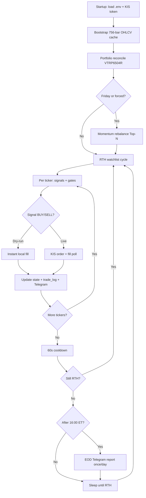

# Multi-Asset Live Quantitative Pipeline & Risk-Resilient Infrastructure

An automated, production-grade quantitative trading infrastructure and empirical telemetry engine built on top of the Korea Investment & Securities (KIS) OpenAPI. The system ingests live market sequences across multi-regime assets, enforces strict liquidity/volatility risk gates, implements a state-gated synchronous execution lock, and programmatically neutralizes Virtual Trading Server (VTS) sandbox anomalies.

| Field | Value |
|---|---|
| **System Status** | **Phase 4 live** — Legacy 60% + Top3 40% on **$100,000** total (`CAPITAL_AT_RISK`) |
| **Config Architecture** | `config.py` → `StrategyConfigMapper.for_ticker()` — MEGA / HIGH_BETA / MOMENTUM / DEFAULT (all `breakout`) |
| **Dual Strategy** | `deployment_config.py` — Legacy signal engine + Top3 momentum rebalance (separate sizing pools) |
| **Universe Filter** | Legacy: full watchlist signals · Top3: equal-weight Top-3, Friday rebalance (`top3_strategy.py`) |
| **Regime Filter** | SPY 200MA gate + optional QQQ half-size when SPY bear / QQQ bull (`USE_QQQ_REGIME_FILTER`) |
| **Watchlist Matrix** | 15 US names (AAPL, MSFT, NVDA, META, AMZN, GOOGL, TSLA, AMD, AVGO, NFLX, PLTR, CRWD, TSM, SHOP, UBER) — configurable via `.env` `WATCHLIST`; routing in `market_registry.py` |
| **Broker Gateway** | Korea Investment & Securities (KIS) OpenAPI (VTS sandbox) |
| **Account** | Set in `.env` — `KIS_CANO`, `KIS_ACNT_PRDT_CD` (never commit) |
| **Execution Loop** | 60s watchlist cycle **during NY RTH only** (09:30–16:00 ET); sleeps off-hours |
| **Data Architecture** | Bootstrap 756 bars once → 1-bar micro-fetch per open-session cycle |
| **Session Gate** | NYSE holiday registry + **`is_us_regular_market_hours()`** (09:30–16:00 ET via `pytz`) |
| **Execution Integrity** | Same-bar sequential ATR stop → trailing update → crossover/RSI exit |
| **Timeline Alignment** | All dispatchable signals (`BUY`/`SELL`/`DYNAMIC_ATR_SELL`) bound to NY RTH 09:30–16:00 ET |
| **Reconciliation** | `PortfolioReconciliationEngine` — KIS `VTRP6504R` broker-vs-local sync at startup + daily RTH |
| **Fill Verification** | `OrderFillMonitor` — ccnl/nccs poll; state mutates only on confirmed fills; `trade_log.csv` |
| **Mobile Alerts** | `telegram_notifier.py` — trade reports + system alerts + **EOD summary** (after 16:00 ET) |
| **Dry-Run Mode** | `KIS_DRY_RUN=true` — simulate instant fills locally (no broker API) |
| **Risk Posture** | Documented in Sections 11–14 — backtest/live parity gaps, reconciliation vectors, monitoring telemetry |

**Base URL (VTS Mock):** `https://openapivts.koreainvestment.com:29443`

**Latest production commits:** Capital cap + deployable cash inference · `HEAD` · ccnl-fb reconcile · `f1bf7fc` · EOD/Top3 sync · `4689c11`

---

## Documentation Map

| Document | Audience | Contents |
|---|---|---|
| **[docs/OPERATIONS.md](docs/OPERATIONS.md)** | **Operators** | Deploy, monitor, `.env`, EC2, Telegram, troubleshooting |
| **README.md** (this file) | Engineers / researchers | Strategy math, architecture, backtest parity, API reference |

**Quick links:** [Live system flow](#live-system-flow) · [Improvement journey (why & how)](#improvement-journey--what-changed-and-why) · [Run the bot](docs/OPERATIONS.md#local-setup) · [EC2 deploy](docs/OPERATIONS.md#deploy-to-ec2) · [Env vars](#appendix-c-configuration-externalization-matrix)

---

## Live System Flow

End-to-end path from startup through one trading day. Operator commands live in **[docs/OPERATIONS.md](docs/OPERATIONS.md)**.



**Gate order inside each ticker evaluation** (all must pass for a new BUY):

1. **Calendar** — NYSE session day (not weekend/holiday)
2. **RTH** — 09:30–16:00 America/New_York
3. **Pending lock** — no open unfilled order on this ticker
4. **Momentum** — ticker in Top-N active list (new BUY only; exits always run)
5. **SPY/QQQ regime** — SPY ≤ 200MA blocks BUY; half size when SPY bear + QQQ bull
6. **RiskGuard** — daily loss, max positions, per-ticker exposure
7. **Signal engine** — regime-specific entry (dual / breakout / crossover) + staged exits

**Fill path:** `rt_cd=0` → ccnl/nccs poll → on HTTP 500 fallback to `present-balance` holdings → state mutates only on confirmed fill.

---

## Improvement Journey — What Changed and Why

Read this top-to-bottom for a **single narrative** of every major fix. Each row is one decision: what broke or fell short, why it mattered, what we shipped, and how to verify.

| Step | Problem (why change was needed) | What we did | How to verify |
|---|---|---|---|
| **1** | Fixed 20-day SMA on one ticker whipsawed in sideways markets; no live path. | Built CSV backtest baseline on `AAPL`; measured +0.99% over 3y. | `python run_backtest.py --isolated` |
| **2** | Grid-stacked RSI + volume filters blocked entries; return fell to +0.52%. | Ran SMA grid search; kept 10-day SMA + RSI gate as Phase 2 baseline. | Compare Phase 1 vs 2 in Section 1 chronology |
| **3** | Backtest used static files; live needed KIS API + persisted state. | Live ingestion, `.env` credentials, OAuth cache, English telemetry. | `python main.py` startup + `trading_state.json` |
| **4** | Look-ahead bias, duplicate orders, holiday crashes, 15-ticker scale. | Same-bar ATR sequence, `MarketDataCache`, pending lock, NYSE calendar, liquidity gate. | `python test_analytics.py` Tests 1–4 |
| **5** | One global `.env` strategy hurt NVDA (−16.9% vs B&H +426%). | `config.py` ticker regimes (NVDA / PLTR / DEFAULT); dual MA + conditional RSI exit. | `python run_backtest.py`; NVDA row in Phase 5 table |
| **3-infra** | Daily backtest vs intraday live could drift; broker vs local qty could diverge. | P3: RTH gate, `session_low` ATR scan, `PortfolioReconciliationEngine` (`VTRP6504R`). | `[RECONCILE]` logs; Section [P3](#phase-3-infrastructure-hardening--live-parity-architecture) |
| **6** | `rt_cd=0` updated `held_quantity` before fill → phantom SELLs. | `OrderFillMonitor`, `trade_log.csv`, `RiskGuard`, RTH BUY windows. | `python test_execution_engine.py`; `trade_log.csv` |
| **7** | No mobile signal when fills/errors happened on EC2. | `telegram_notifier.py`, fill callbacks, `--diagnose`; one Bot session per message. | `python telegram_notifier.py --diagnose` |
| **7.1** | Off-hours KIS polls caused timeout spam + useless Telegram WARNINGs. | Zero API off-hours; WARNING Telegram RTH-only; timeout 15s→30s. | `[GATE/RTH]` in logs outside 09:30–16:00 ET |
| **8.0** | ~2k-line README mixed ops commands with strategy math. | Split [docs/OPERATIONS.md](docs/OPERATIONS.md) for deploy/monitor; slim README. | Documentation Map above |
| **8.1** | Manual NYSE calendar missed **Good Friday** → bot could poll on closed days. | Merge `holidays.NYSE`; log `[CALENDAR]` when library adds a date. | `python test_analytics.py` Test 8 |
| **8.2** | Could not see slow KIS calls in production logs. | `kis_http.py`: every call logs `api_response_time`; `[KIS/SLOW]` > `KIS_SLOW_API_MS`. | `[KIS/HTTP]` lines in `project_metrics.log` |
| **8.3** | Transient timeout dropped orders with no retry. | Inline `KIS_ORDER_MAX_RETRIES` + `order_retry_queue.json` each RTH cycle. | `[ORDER/RETRY]` / `[ORDER/QUEUE]` logs |
| **8.4** | Live intraday `session_low` ≠ backtest daily `Low` → false confidence in backtest P&L. | `USE_EOD_ATR_STOPS=true` switches to daily bar low (backtest parity). | Set in `.env`; log `ATR Stop Mode : EOD` |
| **8.5** | Stop proximity visible only on `DYNAMIC_ATR_SELL` banner. | `Trigger Floor Dist` every cycle when positioned. | `[METRICS]` block in Section 9 |
| **8.6** | Tests only run manually before deploy. | GitHub Actions runs all `test_*.py` on push/PR. | `.github/workflows/ci.yml` |
| **9.0** | Fixed 15-ticker trading dilutes capital; no alpha vs B&H benchmark. | Weekly **momentum ranker** — trade Top 5 from universe; walk-forward vs B&H/SPY. | `momentum_ranker.py`, `run_backtest.py --walk-forward` |
| **9.1** | One entry/exit style for all vol profiles; weak staged risk management. | **MEGA / HIGH_BETA / MOMENTUM** regimes; dual entry + hard stop + profit trail + 2-day below 50MA. | `config.py`, `analytics.py` |
| **9.2** | SPY-only macro gate missed QQQ-led rallies in SPY bear. | **SPY+QQQ regime** — half position size when SPY&lt;200MA and QQQ&gt;200MA. | `USE_QQQ_REGIME_FILTER`, `market_registry.py` |
| **9.3** | VTS ccnl/nccs HTTP 500 left fills unsynced (e.g. TSLA phantom pending). | Retry + broker `present-balance` fallback + reconcile pending clear. | `execution_engine.py`, `5ed98ac` |
| **9.4** | No safe way to test signals on EC2; no daily P&L push. | `KIS_DRY_RUN` instant-fill sim; **EOD Telegram** after 16:00 ET. | `daily_report.py`, `KIS_DRY_RUN`, `USE_DAILY_TELEGRAM_REPORT` |
| **9.5** | VTS `present-balance` lists symbols but **qty fields are zero** while holdings exist. | Reconcile substitutes net qty from `inquire-ccnl` aggregation (`[RECONCILE/CCNL-FB]`). | `session_manager.py`, `f1bf7fc` |
| **9.6** | EOD report showed stale local qty; Top3 Phase 4 orders skipped trade log + reconcile. | EOD prefers `broker_holdings` + sync warning; Top3 live orders → `trade_log` + `force=True` reconcile. | `daily_report.py`, `main.py`, `4689c11` |
| **—** | *Still open:* strategy alpha vs buy-and-hold, VIX filter, real-account guard; off-watchlist holdings; VTS cash/ccnl intermittency. | Documented in [Phase 13](#phase-13-broker-holdings-sync--report-parity-2026-06) + Section 11. | Track in Section 14 checklist |

> **Operator path:** after Step 8.0, day-to-day commands live in **[docs/OPERATIONS.md](docs/OPERATIONS.md)**.  
> **Researcher path:** strategy math stays in Sections 2–8 below.

---

## Table of Contents

**Operations (start here for live trading)**

- **[Live System Flow](#live-system-flow)** — end-to-end gate + fill pipeline
- **[Improvement Journey — what changed & why](#improvement-journey--what-changed-and-why)**
- **[Production Operations Guide](docs/OPERATIONS.md)** — deploy, monitor, Telegram, EC2, troubleshooting

**Architecture & chronology**

1. [Project Evolution](#1-project-evolution--development-chronology)
- [Phase 3 Architecture](#phase-3-architecture-ticker-specific-configuration--macro-regime-filtering)
- [Phase 8 Hardening](#phase-8-production-hardening--readme-improvement-log)
- [Phase 9 Strategy Overhaul](#phase-9-momentum-universe-strategy-overhaul--ops-polish-2026-06)
2. [Same-Bar Look-Ahead Fix](#2-dedicated-section-same-bar-look-ahead-bias-eradication)
3. [RSI Crossdown Exit](#3-dedicated-section-rsi-crossdown-exit-engine)
4. [Dual-Clamp Sizing](#4-dedicated-section-dual-clamp-position-sizing)
5. [NYSE Holiday & Sleep Logic](#5-dedicated-section-nyse-holiday-registry--loop-suppression)
6. [System Architecture](#6-system-architecture--core-topologies)
7. [Production Safeguards](#7-operational-hardening--production-safeguards)
8. [Strategy Parameters](#8-strategy-configurations--parameters)
9. [Operational Guidelines & Tests](#9-operational-guidelines--verification-suite)

**Reference**

10. [KIS API Mapping](#10-kis-openapi-interface-gateway-reference-mapping)
11. [Core Risks](#11-core-risks--worst-case-operational-scenarios)
12. [Hardening Vectors](#12-pre-deployment-critical-architectural-flaws--hardening-vectors)
13. [Telemetry Matrix](#13-high-priority-telemetry-channels-live-monitoring-matrix)
14. [Action Plan & Checklist](#14-final-operational-directives--action-plan)

**Appendices**

- [A. VTS Incident Ledger](#appendix-a-infrastructure-patch-ledger-vts-mock-api-bypasses)
- [B. Signal Priority Rules](#appendix-b-signal-priority--execution-rules)
- [C. Environment Variables](#appendix-c-configuration-externalization-matrix)
- [D. Project Structure](#appendix-d-project-structure)
- [E. Watchlist Regime Map](#appendix-e-academic-regime-mapping-watchlist-design)
- [License & Disclaimer](#license--disclaimer)

---

## 1. Project Evolution & Development Chronology

### Phase 1: Static Backtesting Infrastructure (Baseline)

- **Architecture**: Single-ticker backtest on `AAPL` using a fixed 20-day SMA crossover over 3 years of historical daily data loaded from flat CSV files.
- **Performance**: Net return **+0.99%** — Final Portfolio Value **$10,099.42**.
- **Insight**: High vulnerability to whipsaws and capital erosion in sideways markets. A fixed lookback period without momentum or risk controls produced unreliable entry timing.

### Phase 2: Parameter Optimization & Multi-Indicator Filtering

- **Architecture**: Grid-search optimization (SMA 10–50, step 5) converged on a **10-day SMA** paired with a **14-day RSI** momentum filter (BUY when RSI >= 50; Overbought exit when RSI > 70 or SMA death cross).
- **Performance**: Net return **+0.52%** — Final Portfolio Value **$10,052.18**.
- **Insight**: Stacking uncorrelated indicators choked profitable entries (False Negative dilemma). Reduced whipsaw frequency came at the cost of missed momentum breakouts.

### Phase 3: Production-Ready Live Signal Pipeline

- **Architecture**: Replaced static CSV dependencies with automated, live API ingestion. Integrated credential encryption layers via `.env` state protection and established clean exception frameworks to process broker authorization sequences dynamically.
- **Capability**: Dynamic data persistence, standardized English console telemetry, and integrated Backtrader performance analyzers (Final Portfolio Value, Sharpe Ratio, Max Drawdown).

### Phase 4: Dynamic ATR Risk Engine & Mathematical Integrity Corrections

- **Architecture**: Expanded to a **15-ticker** parallel watchlist (default in `market_registry.py`: AAPL, MSFT, NVDA, META, AMZN, GOOGL, TSLA, AMD, AVGO, NFLX, PLTR, CRWD, TSM, SHOP, UBER) executing live routines through the KIS sandbox server (`openapivts.koreainvestment.com:29443`). Optional **SPY > 200MA** market filter blocks new BUY entries in bear regimes (`USE_SPY_MARKET_FILTER=true`).
- **Core Engineering Patches**: Mitigated critical production failures by implementing a localized memory bar caching engine (`MarketDataCache`), a state-gated concurrency lock to eliminate duplicate order flooding, an institutional volume liquidity surge gate, and a rigorous series of financial logic patches to eliminate same-bar look-ahead bias, capital over-leverage rejections, and weekend/holiday runtime crashes.

### Phase 5: Ticker-Specific Configuration & Macro Regime Filtering

- **Architecture**: Eliminated global `.env` execution-parameter overrides (`SMA_PERIOD`, `ATR_MULTIPLIER`, etc.) in favor of a hardcoded **TickerConfig isolation matrix** in `config.py`, resolved at runtime via `StrategyConfigMapper.for_ticker(ticker)`.
- **Core Logic Patch**: Introduced dual-moving-average regime filtering (`SMA_SHORT` + 50-day `SMA_LONG`) with **asymmetric entry/exit mechanics** — trend-gated entries and whipsaw-protected conditional RSI exits during macro bull runs.
- **Empirical Impact** (756-bar backtest, 2023-06 → 2026-06, `run_backtest.py`):

| Ticker | Pre-Isolation Return | Post-Isolation Return | Buy & Hold |
|---|---|---|---|
| **NVDA** | **-16.9%** | **+16.3%** | +426.4% |
| **PLTR** | +208.8% | +72.5% | +754.0% |
| **AAPL** | +4.4% | +7.9% | +66.6% |

- **Insight**: One-size-fits-all parameters forced high-beta trend leaders through conservative gates, producing catastrophic underperformance vs. buy-and-hold. Structural regime mapping per ticker reduced whipsaw variance without stacking noisy sub-indicators (see [Phase 3 Architecture](#phase-3-architecture-ticker-specific-configuration--macro-regime-filtering)).

### Phase 6: Fill Verification, Trade Log & Risk Gates *(2026-06)*

- **Problem**: KIS returned `rt_cd=0` (accepted) before shares filled — local state showed positions that did not exist → invalid SELL orders.
- **Why it mattered**: Any sizing or stop logic built on phantom `held_quantity` is unsafe for live capital.
- **Fix**: Poll `inquire-ccnl` / `inquire-nccs` until fill confirms; append `trade_log.csv`; `RiskGuard` caps loss/exposure; block new BUY near open/close.
- **Phase 9 patch**: VTS HTTP 500 on ccnl/nccs → retry + infer fill from `present-balance` (`[FILL/BROKER-FB]`); reconcile clears stale pending locks.
- **Commit**: `66951a6` (P6) · `5ed98ac` (fill fallback) — see [OPERATIONS.md — Phase 6](docs/OPERATIONS.md#phase-6--fills--risk).

### Phase 7: Telegram Mobile Alerts *(2026-06)*

- **Problem**: Bot ran headless on EC2 — no push notification on fills or crashes.
- **Why it mattered**: Operator had to SSH + `tail -f` to learn the bot failed or traded.
- **Fix**: `telegram_notifier.py` + fill callbacks; `async with Bot` per message; gated by `USE_TELEGRAM_ALERTS`.
- **Commit**: `872f7d2` — see [OPERATIONS.md — Phase 7](docs/OPERATIONS.md#phase-7--telegram-integration).

### Phase 7.1: RTH-Only Polling & Alert Hardening *(2026-06)*

- **Problem**: VTS API timeouts and reconcile `500` errors during **off-hours** produced log noise and Telegram WARNING spam — even though orders were already RTH-gated.
- **Fix**: `main.py` skips the entire watchlist cycle (zero KIS HTTP calls) outside NY RTH; sleeps until the next session window via `seconds_until_us_rth_open()`. WARNING-level Telegram alerts are **log-only** off-hours; CRITICAL alerts still push. KIS HTTP timeout default raised **15s → 30s** (`KIS_REQUEST_TIMEOUT_SECONDS`).
- **Commit**: `46767be` — see [OPERATIONS.md — Phase 7.1](docs/OPERATIONS.md#phase-71--rth-only-polling).

### Phase 8: Production Hardening & README Improvement Log *(2026-06)*

Closed gaps from [Section 12](#12-pre-deployment-critical-architectural-flaws--hardening-vectors). Full timeline: [Improvement Journey](#improvement-journey--what-changed-and-why). Detail by patch:

| Step | Problem (why) | Fix | Module |
|---|---|---|---|
| **8.1** | Manual calendar missed **Good Friday** — bot could call KIS on closed days | Merge `holidays.NYSE`; `[CALENDAR]` drift logs | `analytics.py` |
| **8.2** | No latency visibility — slow VTS looked like “random HOLD” | `[KIS/HTTP]` + `api_response_time`; `[KIS/SLOW]` threshold | `kis_http.py` |
| **8.3** | One timeout = lost order intent | Inline retry + `order_retry_queue.json` per RTH cycle | `order_retry_queue.py` |
| **8.4** | Live intraday stops ≠ backtest daily `Low` | `USE_EOD_ATR_STOPS=true` for parity (default keeps legacy) | `analytics.py`, `session_manager.py` |
| **8.5** | Stop distance only logged on sell signal | `Trigger Floor Dist` every cycle when positioned | `main.py` |
| **8.6** | Regressions caught only manually | GitHub Actions CI on all `test_*.py` | `.github/workflows/ci.yml` |
| **8.7** | Ops mixed into 2k-line README | Split [docs/OPERATIONS.md](docs/OPERATIONS.md) | `docs/` |

**Recommended for backtest-aligned live runs:** set `USE_EOD_ATR_STOPS=true` in `.env`.  
**Recommended for production VTS (Phase 4):** `CAPITAL_AT_RISK=100000`, `DEPLOYMENT_PHASE=4`, `STRATEGY_MODE=dual`, `MOMENTUM_RANK_ENABLED=false`, `USE_QQQ_REGIME_FILTER=true`, `USE_DAILY_TELEGRAM_REPORT=true`, `KIS_DRY_RUN=false`.  
**Still open (not auto-fixable):** sustained alpha vs buy-and-hold, VTS→real-account migration, 60s polling latency, VIX filter.

### Phase 9: Momentum Universe, Strategy Overhaul & Ops Polish *(2026-06)*

| Upgrade | Module | Summary |
|---|---|---|
| **Momentum Top-N ranker** | `momentum_ranker.py` | 3M/6M/12M return + volume stability; Friday rebalance; gates new BUY only |
| **Three entry regimes** | `config.py` | MEGA (dual), HIGH_BETA (dual), MOMENTUM (breakout-only) |
| **Staged exits** | `analytics.py` | Hard stop (−5% or 2×ATR), profit trail (+15% arms, −10% from peak), 2-day below 50MA |
| **SPY+QQQ regime sizing** | `analytics.py` + `main.py` | Normal / half size / risk-off from SPY+QQQ 200MA |
| **Fill sync hardening** | `execution_engine.py` | ccnl/nccs retry + broker holdings fallback on VTS HTTP 500 |
| **Walk-forward benchmarks** | `backtest_benchmarks.py` | Equal-weight B&H + SPY alpha columns in `--walk-forward` table |
| **Dry-run mode** | `main.py` | `KIS_DRY_RUN=true` — instant simulated fills, no KIS order API |
| **EOD Telegram report** | `daily_report.py` | Once per NY session after 16:00 ET — equity, day PnL, fills, holdings |

**Verify:**

```powershell
python run_backtest.py --walk-forward --yfinance
python test_momentum_ranker.py
python test_backtest_benchmarks.py
python test_daily_report.py
```

### Phase 10: Trend Hold & Exit Discipline *(2026-06)*

| Upgrade | Module | Summary |
|---|---|---|
| **Breakout-only entries** | `config.py` | All regimes use `entry_mode=breakout` (20-day high); dual/pullback removed |
| **Wider hard stop** | `config.py` | `stop_loss_pct=0.08` (−8%) + 2× ATR floor across regimes |
| **Min-hold gate** | `analytics.py` | `min_hold_days=5` blocks soft exits (trail, trend, RSI, crossover) |
| **Regime trend exits** | `config.py` | MEGA/DEFAULT: 5-day below 50MA; HIGH_BETA/MOMENTUM: disabled + `skip_trend_exit_when_ranked` |
| **Profit trails** | `config.py` | MEGA 18%/15%; HIGH_BETA 20%/15%; MOMENTUM 25%/18% |
| **Top-3 momentum** | `momentum_ranker.py` | `MOMENTUM_TOP_N` default **3** (concentrated capital) |
| **Exit telemetry** | `analytics.py` + `portfolio_backtest.py` | `exit_reason` on SELL; backtest summary table by trigger |

**Verify:**

```powershell
python run_backtest.py --walk-forward --yfinance --momentum-top-n 3
python test_analytics.py
```

### Phase 11: Top-N Winner Hold *(2026-06)*

| Upgrade | Module | Summary |
|---|---|---|
| **Crossover hold** | `analytics.py` | Skip death-cross / RSI exit while ticker is in momentum Top-N set |
| **MOMENTUM trail** | `config.py` | Profit-trail arm lowered to **15%** (from 25%) |

### Phase 12: Dual-Strategy Deployment *(2026-06)*

| Upgrade | Module | Summary |
|---|---|---|
| **Four-phase rollout** | `deployment_config.py` | Phase 1 legacy → Phase 2 compare backtest → Phase 3 shadow → Phase 4 live split |
| **Top3 backtest** | `top3_backtest.py` | Standalone equal-weight Top-3 momentum portfolio |
| **Top3 live path** | `top3_strategy.py` + `main.py` | Shadow (phase 3) or KIS orders (phase 4) on separate capital slice |
| **Compare CLI** | `run_backtest.py --strategy compare` | Legacy vs Top3 side-by-side on same window |

**Production (Phase 4):** `CAPITAL_AT_RISK=100000` → Legacy **$60,000** sizing + Top3 **$40,000** sizing. See [Dual-Strategy Deployment Phases](#dual-strategy-deployment-phases-env).

### Phase 13: Broker Holdings Sync & Report Parity *(2026-06)*

| Upgrade | Module | Summary |
|---|---|---|
| **VTS qty bug workaround** | `session_manager.py` | When `present-balance` rows show symbols but all qty fields are 0, net position from ccnl fill history replaces the snapshot |
| **ccnl reconcile fallback** | `session_manager.py` | `[RECONCILE/CCNL-FB]` when present-balance qty is empty — aggregates `ccld_qty` by symbol over a date window |
| **EOD holdings fallback** | `daily_report.py` | Telegram EOD prefers `_portfolio.broker_holdings` when local `held_quantity` lags; ⚠️ sync warning if reconcile failed |
| **Top3 Phase 4 lifecycle** | `main.py` | Live Top3 orders append `trade_log.csv` (`top3 odno=…`); post-batch `force=True` reconcile + fill monitor |
| **Deployable cash inference** | `session_manager.py` + `main.py` | When VTS USD cash=0: `available_cash = max(0, CAPITAL_AT_RISK − marked holdings)`; `[RECONCILE/CAP]` when over-deployed |
| **Portfolio buy gates** | `execution_engine.py` + `main.py` | `MAX_PORTFOLIO_USD` (defaults to `CAPITAL_AT_RISK`); blocks new BUY when deployable cash ≤ 0 or ticker/portfolio cap exceeded |
| **Top3 broker-aware rebalance** | `top3_strategy.py` | Phase 4 uses live `held_quantity` as current — trims over-size (e.g. duplicate Legacy+Top3 fills) toward Top3 slice targets |

**Known VTS limitations (not auto-fixed):**

- **Off-watchlist holdings** — symbols outside `WATCHLIST` (e.g. RDW) are not tracked; reconcile ignores them.
- **Broker USD cash field** — when nonzero, used directly; otherwise deployable cash is inferred from marks (not broker ledger).
- **ccnl HTTP 500** — intermittent on VTS; fill poll and reconcile retry on the next RTH cycle.

**Operator check:** `[RECONCILE/CCNL-FB]` / `[RECONCILE/MISMATCH]` in logs; compare KIS app vs `held_quantity` in `trading_state.json`.

| Upgrade | Module | Summary |
|---|---|---|
| **Same-Bar Sequential Integrity** | `analytics.py` + `strategy.py` | ATR stop vs *prior* `trigger_floor` before peak update |
| **RSI Crossdown Exit** | `analytics.py` + `strategy.py` | Verified crossdown — not blind >70 threshold |
| **Dual-Clamp Position Sizing** | `analytics.py` | Risk budget ∩ capital budget |
| **NYSE Holiday Registry** | `analytics.py` + `main.py` | Replaces naive `weekday < 5` |
| **NY Regular Hours Gate** | `analytics.py` (`pytz`) | 09:30–16:00 America/New_York; DST-safe |
| **State Persistence Fix** | `analytics.py` + `main.py` | `last_processed_date` only on executed signals |
| **Dynamic Memory Window Caching** | `main.py` → `MarketDataCache` | 756-bar bootstrap once; 1-bar micro-fetch per cycle |
| **State-Gated Order Lifecycle** | `main.py` + `analytics.py` | Dispatch → verify → lock → persist → transition |
| **Hybrid EOD / Intraday Engine** | `analytics.py` | Bar-trailing crossover gate + continuous ATR scan |
| **Liquidity Gate** | `analytics.py` + `strategy.py` | Ticker-scaled volume surge gate + intraday session fraction (live polls) |
| **Configuration Externalization** | `config.py` → `StrategyConfigMapper` | Ticker-isolated signal params; `.env` for credentials/capital only |
| **Ticker Regime Isolation** | `config.py` + `analytics.py` + `strategy.py` | NVDA / PLTR / DEFAULT matrix; dual MA; asymmetric RSI exit |
| **P3 RTH Execution Gate** | `session_manager.py` + `main.py` | Zero-leakage block on all dispatchable signals outside 09:30–16:00 ET |
| **P3 Intraday Session Low** | `session_manager.py` + `analytics.py` | Real-time `session_low` ATR stop parity with daily backtest `Low` trigger |
| **P3 Portfolio Reconciliation** | `session_manager.py` + `main.py` | KIS `VTRP6504R` broker override + deployable cash refresh |
| **P6 Fill Verification** | `execution_engine.py` + `main.py` | ccnl/nccs poll; partial fills; `trade_log.csv`; risk gates |
| **P7 Telegram Alerts** | `telegram_notifier.py` + `main.py` | Trade reports on fill; CRITICAL/WARNING system alerts |
| **P7.1 RTH-Only Loop** | `main.py` + `analytics.py` | No KIS API off-hours; suppress WARNING Telegram off-hours; 30s timeout |
| **P8 NYSE Calendar Merge** | `analytics.py` | `holidays.NYSE` cross-check; Good Friday + drift logs |
| **P8 API Latency Telemetry** | `kis_http.py` | `api_response_time` on all KIS HTTP calls |
| **P8 Order Retry Queue** | `order_retry_queue.py` + `main.py` | Inline + persistent retry for transient failures |
| **P8 EOD ATR Parity Mode** | `analytics.py` + `session_manager.py` | `USE_EOD_ATR_STOPS` aligns live stops with backtest |
| **P8 CI** | `.github/workflows/ci.yml` | Automated verification suite on push/PR |

Additional Phase 4 safeguards preserved from prior milestones:

- **Exact liquidation quantity synchronization**: SELL orders clamp to `held_quantity` — never sell more than locally tracked holdings.
- **Non-blocking balance inquiry**: `try_print_mock_account_balance()` via TR `VTRP6504R` — failures logged as `[INFO]`, never block the loop.
- **PLTR NASDAQ VTS proxy**: `excd: NAS`, `ovrs_excg_cd: NASD` — bypasses 0-bar NYS truncation.
- **NY regular-hours gate (P3 hardened)**: `RegularHoursGate` blocks **all** dispatchable signals (`BUY`, `SELL`, `DYNAMIC_ATR_SELL`) outside 09:30–16:00 ET — matching daily backtest session boundaries.
- **State persistence fix**: `last_processed_date` updates only after `BUY` / `SELL` / `DYNAMIC_ATR_SELL` order transitions — never on `HOLD`.
- **Backtest/live parity**: `TrendTradingStrategy` and `LiveSignalEngine` share identical regime gates, 3-step trailing sequence, and Backtrader `set_coc(True)`.

---

## Phase 3 Architecture: Ticker-Specific Configuration & Macro Regime Filtering

This section documents the **Phase 3 architectural evolution** of the execution engine: the transition from global, one-size-fits-all `.env` strategy parameters to a **Ticker-Specific Configuration Isolation Architecture** with an **Asymmetric 50-Day Regime Trend Filter**. This refactor directly addresses the structural underperformance observed in strong-trend, high-beta assets (notably NVDA at **-16.9%** strategy return vs. **+426%** buy-and-hold under the prior global configuration).

### A. Problem Statement: Global Parameters, Local Regimes

Prior to this refactor, all watchlist symbols consumed identical execution parameters loaded from `.env`:

```ini
# DEPRECATED for signal generation — no longer consulted by LiveSignalEngine
SMA_PERIOD=10
ATR_MULTIPLIER=2.0
VOLUME_THRESHOLD=1.2
RSI_BUY_THRESHOLD=50
```

This global model produced three measurable failures:

1. **Regime mismatch**: NVDA (high-beta trend leader) and AAPL (low-volatility control) were forced through identical SMA/ATR/volume gates, causing premature RSI exits and tight ATR stops during parabolic bull runs.
2. **Whipsaw amplification**: Phase 2 grid-search stacking (RSI + volume + SMA) reduced trade count but did not adapt to per-asset volatility — net return fell from **+0.99%** to **+0.52%** (classic overfitting to in-sample noise).
3. **Backtest/live divergence**: A single `LiveSignalEngine(STRATEGY_CONFIG)` instance could not express symbol-specific risk posture; `main.py` evaluated NVDA with the same thresholds as AAPL.

**Resolution**: Signal parameters now resolve exclusively through `config.py`. The `.env` file retains **credentials**, **watchlist membership**, **capital sizing**, and **loop timing** only.

### B. Configuration Isolation Matrix (`config.py`)

Two dataclasses form the isolation layer:

| Class | Role |
|---|---|
| **`TickerConfig`** | Regime-scoped parameter bundle: `sma_period`, `rsi_buy_threshold`, `volume_threshold`, `atr_multiplier`, `use_trend_filter` |
| **`StrategyConfig`** | Fully resolved, ticker-bound config materialized from `TickerConfig` + shared infrastructure constants (RSI/ATR periods, `sma_long_period=50`) |
| **`StrategyConfigMapper`** | Central registry: `StrategyConfigMapper.for_ticker("NVDA")` → isolated `StrategyConfig` |

#### Hardcoded Regime Parameter Table

| Regime Key | Profile | `sma_period` | `rsi_buy` | `volume_mult` | `atr_mult` | `use_trend_filter` |
|---|---|---|---|---|---|---|
| **`NVDA`** | High Volatility / Strong Trend | **10** | **42** | **0.75** | **3.0** | **True** |
| **`PLTR`** | High Volatility / Breakout | **10** | **45** | **0.85** | **2.5** | **False** |
| **`DEFAULT`** | Conservative / Low Volatility (`AAPL`, unlisted) | **20** | **50** | **1.0** | **2.0** | **True** |

Symbols not explicitly mapped in `_EXPLICIT` fall through to `DEFAULT`. Add new explicit mappings in `config.py` — not in `.env`.

#### Resolution Flow

```
process_ticker("NVDA")
    │
    ▼
LiveSignalEngine("NVDA")
    │
    ▼
StrategyConfigMapper.for_ticker("NVDA")
    │
    ▼
StrategyConfig(ticker="NVDA", sma_period=10, atr_multiplier=3.0, use_trend_filter=True, ...)
    │
    ├─► analytics.py  → IndicatorAnalytics.populate_indicators(df, config)
    └─► strategy.py   → TrendTradingStrategy(ticker="NVDA")  [backtest parity]
```

### C. Dual-Moving-Average Indicator Pipeline

`IndicatorAnalytics.populate_indicators()` in `analytics.py` computes a **dual MA structure** on every bar refresh:

| Column | Window | Source | Purpose |
|---|---|---|---|
| **`SMA_SHORT`** | Dynamic `config.sma_period` | Ticker-isolated | Golden Cross / Death Cross execution SMA |
| **`SMA_LONG`** | Fixed `50` (`sma_long_period`) | Shared infrastructure | Macro regime filter baseline |
| **`RSI`** | 14 (Wilder) | Shared | Entry momentum gate + conditional exit |
| **`ATR`** | 14 (Wilder) | Shared | Dynamic trailing stop distance |
| **`Volume_SMA`** | 20 | Shared | Liquidity surge baseline |

```python
# analytics.py — IndicatorAnalytics.populate_indicators()
enriched["SMA_SHORT"] = calculate_sma(enriched, config.sma_period)      # ticker-isolated
enriched["SMA_LONG"]  = calculate_sma(enriched, config.sma_long_period)  # fixed 50-day
```

The short SMA window adapts per ticker via `StrategyConfigMapper` (e.g. 10 for NVDA/high-beta regimes, 20 for DEFAULT large-cap). The long SMA is always 50 days - the macro regime anchor.

### D. Asymmetric Entry / Exit Mechanics

Signal evaluation is **asymmetric by design**: entries require regime compliance; exits split into unconditional emergency triggers vs. conditional momentum exits.

#### Entry Gate (Flat Position → BUY)

All four conditions must pass simultaneously:

| # | Gate | Condition |
|---|---|---|
| 1 | **Golden Cross** | $\text{Close}_t > \text{SMA\_SHORT}_t$ AND $\text{Close}_{t-1} \le \text{SMA\_SHORT}_{t-1}$ |
| 2 | **RSI Gate** | $\text{RSI}_t \ge \text{rsi\_buy\_threshold}$ (ticker-specific: 42 / 45 / 50) |
| 3 | **Volume Gate** | $\text{Volume}_t > \text{Volume\_SMA}_{20} \times \text{volume\_mult}$ |
| 4 | **Trend Filter** *(if `use_trend_filter=True`)* | $\text{Close}_t > \text{SMA\_LONG}_t$ **OR** $\text{SMA\_SHORT}_t > \text{SMA\_LONG}_t$ |

When `use_trend_filter=False` (PLTR breakout regime), Gate 4 is bypassed — entries fire on crossover + RSI + volume alone.

**Rationale**: Requiring price or short SMA above the 50-day baseline prevents counter-trend entries in weak macro regimes while still allowing early trend capture when the short SMA leads price above the long baseline.

#### Whipsaw-Protected Exit (Positioned → SELL)

Exit evaluation follows the immutable 3-step in-position sequence (Section 2), then applies asymmetric exit rules:

| Exit Type | Condition | Regime Behavior |
|---|---|---|
| **`DYNAMIC_ATR_SELL`** | $\text{Low}_t \le \text{Trigger Floor}_{t-1}$ | Always active when positioned (including pre/post-market) |
| **Death Cross** | $\text{Close}_t < \text{SMA\_SHORT}_t$ (verified cross) | **Unconditional** — emergency exit regardless of macro regime |
| **RSI Crossdown** | $\text{RSI}_{t-1} \ge 50$ AND $\text{RSI}_t < 50$ | **Conditional** — see regime table below |

##### RSI Crossdown Regime Matrix

| `use_trend_filter` | Macro Regime | RSI Crossdown (< 50) Fires? |
|---|---|---|
| **False** (PLTR) | Any | **Yes** — always eligible |
| **True** (NVDA, DEFAULT) | Bull: $\text{Close}_t \ge \text{SMA\_LONG}_t$ | **No** — suppressed to let winners run |
| **True** (NVDA, DEFAULT) | Weak: $\text{Close}_t < \text{SMA\_LONG}_t$ | **Yes** — momentum loss confirmed in bearish regime |

**Rationale**: During parabolic bull runs, RSI routinely dips below 50 on healthy pullbacks. Unconditional RSI exits caused NVDA to be shaken out of multi-month trends. Suppressing RSI exit while price holds above the 50-day SMA eliminates this whipsaw class while preserving death cross and ATR stop as hard safety nets.

### E. Operational Signal Flow (Per-Ticker Cycle)

```
For each ticker in WATCHLIST:
  │
  ├─ 1. Resolve config: StrategyConfigMapper.for_ticker(ticker)
  │
  ├─ 2. Instantiate: LiveSignalEngine(ticker)
  │
  ├─ 3. Fetch OHLCV → IndicatorAnalytics.populate_indicators(df, config)
  │       └─ Computes SMA_SHORT, SMA_LONG, RSI, ATR, Volume_SMA
  │
  ├─ 4. Replay state through evaluate_bar() with ticker-specific gates
  │
  ├─ 5. Evaluate today's signal:
  │       ├─ Positioned?
  │       │    ├─ ATR stop (Priority 1)
  │       │    ├─ Death cross → SELL (unconditional)
  │       │    └─ RSI crossdown → SELL (regime-conditional)
  │       └─ Flat?
  │            └─ Golden cross + RSI + Volume + Trend filter → BUY
  │
  └─ 6. Dispatch order → state transition → persist trading_state.json
```

Backtest parity: `python run_backtest.py` runs the **consolidated portfolio** simulator (`portfolio_backtest.run_portfolio_backtest`) with `LiveSignalEngine` + dual-clamp sizing. Legacy per-ticker Backtrader mode: `python run_backtest.py --isolated` via `create_backtest_cerebro(ticker)`.

### F. Data Science Justification: Structural Regime Mapping vs. Indicator Stacking

Phase 2 attempted to reduce whipsaws by **adding filters** (RSI threshold, volume surge, shorter SMA grid search). This increased model complexity without reducing **variance** — it traded false positives for false negatives (+0.99% → +0.52%).

The Phase 3 architecture takes a different approach:

| Approach | Mechanism | Overfitting Risk |
|---|---|---|
| **Phase 2 (rejected)** | Stack independent sub-indicators on one global parameter set | High — each filter adds degrees of freedom tuned to the same in-sample window |
| **Phase 3 (current)** | Map 3 discrete volatility regimes to isolated parameter bundles | Low — 3 regimes × 5 parameters = bounded structural hypothesis, not continuous grid search |

Key properties that limit overfitting:

1. **Regime count is fixed** (3 buckets: NVDA / PLTR / DEFAULT) — not optimized by walk-forward grid search.
2. **Long SMA window is fixed at 50** — not tuned per ticker.
3. **RSI exit threshold is fixed at 50** — the *conditional application* (not the threshold itself) adapts by regime.
4. **Out-of-sample validation**: NVDA return improved from -16.9% to +16.3% on the full 756-bar window without adding new indicators — only structural parameter isolation and asymmetric exit logic.

This is **variance reduction through regime conditioning**, not **bias reduction through filter accumulation**.

### G. Module Reference

| Module | Class / Function | Responsibility |
|---|---|---|
| `config.py` | `TickerConfig`, `StrategyConfig`, `StrategyConfigMapper` | Hardcoded regime matrix; `for_ticker()` resolution |
| `analytics.py` | `IndicatorAnalytics.populate_indicators()` | Dual MA + RSI + ATR + Volume computation |
| `analytics.py` | `LiveSignalEngine(ticker)` | Live signal evaluation with asymmetric gates |
| `strategy.py` | `TrendTradingStrategy(ticker=...)` | Backtrader twin with identical entry/exit mathematics |
| `run_backtest.py` | `run_portfolio_backtest()` (default) | Consolidated portfolio backtest — shared cash ledger |
| `run_backtest.py` | `create_backtest_cerebro(ticker)` (`--isolated`) | Legacy per-ticker Backtrader validation |
| `portfolio_backtest.py` | `run_portfolio_backtest()` | Live-parity portfolio simulation engine |

---

## Phase 3: Infrastructure Hardening & Live Parity Architecture

This section documents **Production Phase P3** — the infrastructure layer that closes the structural gap between daily-bar backtesting and real-time intraday execution. P3 delivers three hardened subsystems in `session_manager.py`, integrated into `main.py` and `analytics.py`, to prevent metric drift when the P2 consolidated portfolio backtest (Sharpe 1.25, MaxDD 2.61%) is deployed to the KIS VTS live loop.

### A. Regular-Hours Trading Gate (RTH Enforcer)

#### Design Objective

Daily backtests evaluate signals on completed NYSE session bars (09:30–16:00 ET). Pre-market and after-hours price action must not generate entries, crossover exits, or ATR stop dispatches — otherwise live performance diverges from backtest assumptions.

#### `RegularHoursGate` Mechanics

`RegularHoursGate` in `session_manager.py` delegates clock authority to `is_us_regular_market_hours()` in `analytics.py` (DST-safe via `pytz`, America/New_York). The gate exposes two static methods:

| Method | Purpose |
|---|---|
| `is_rth(now)` | Returns `True` when NY calendar is open **and** `09:30 ≤ time < 16:00` ET |
| `block_signal_for_session(signal, regular_market_hours)` | Returns `True` when `signal ∈ {BUY, SELL, DYNAMIC_ATR_SELL}` and `regular_market_hours=False` |
| `gate_message(signal, ticker)` | Emits standardized `[GATE/RTH]` console telemetry |

```python
@staticmethod
def block_signal_for_session(signal: str, regular_market_hours: bool) -> bool:
    if regular_market_hours:
        return False
    return signal in {"BUY", "SELL", "DYNAMIC_ATR_SELL"}
```

#### Dual-Layer Integration (Zero-Leakage Enforcement)

RTH blocking is applied at **two independent checkpoints** so no dispatchable signal can leak outside regular hours:

**Layer 1 — `LiveExecutionGatekeeper.evaluate_live_signals()`**

After `evaluate_trading_cycle()` produces a base signal, the gatekeeper runs the intraday ATR scan first (Section B), then converts any remaining dispatchable signal to `HOLD` with metadata:

```python
if self.rth_gate.block_signal_for_session(base_signal, regular_market_hours):
    signal_result = {
        "signal": "HOLD",
        "crossover_suppressed": True,
        "outside_regular_hours": True,
        "blocked_signal": base_signal,
    }
```

**Layer 2 — `process_ticker()` final dispatch guard**

Before KIS order transmission, `main.py` re-validates through `_rth_gate.block_signal_for_session()` and prints `gate_message()`. If blocked, state is persisted and the function returns `"HOLD"` without broker contact.

**Layer 3 — `LiveSignalEngine.evaluate_trading_cycle()`**

Inside `analytics.py`, any signal promoted to `BUY`, `SELL`, or `DYNAMIC_ATR_SELL` outside RTH is forcibly demoted to `HOLD` with `outside_regular_hours=True` before sizing is computed.

```
evaluate_trading_cycle()          LiveExecutionGatekeeper          process_ticker()
        │                                  │                              │
        ├─ RTH demote (analytics)          ├─ Intraday ATR scan first     ├─ RTH final guard
        └─ signal_result                   ├─ RTH block → HOLD            └─ KIS dispatch (RTH only)
                                           └─ crossover re-eval (RTH)
```

#### Pre/Post-Market Cycle Behavior

| Phase | Loop Runs? | Reconciliation? | Signals Dispatched? |
|---|---|---|---|
| Weekend / NYSE holiday | Skipped (extended sleep) | No | No |
| Weekday pre-market | Yes (telemetry) | No | **No** — all blocked |
| Regular hours (RTH) | Yes | Yes (once per session day) | Yes |
| Weekday after-hours | Yes (telemetry) | No | **No** — all blocked |

Console markers:

```
[GATE/RTH] Outside NY regular hours (09:30-16:00 ET) — all signals blocked until RTH open
[GATE/RTH] NVDA — BUY blocked outside NY regular session (09:30-16:00 ET). Matching daily backtest session boundary.
RTH Blocked Signal   : BUY (pre/post-market gate)
```

---

### B. Intraday Session Low Stop Engine

#### Design Objective

In the daily backtest, the ATR trailing stop triggers when the bar's **Low** breaches the prior `trigger_floor`:

$$
\text{DYNAMIC\_ATR\_SELL} \iff \text{Low}_t \le \text{Trigger Floor}_{t-1}
$$

Live execution polling every 60 seconds cannot wait for bar close — checking only interim `Close` introduces severe lag. P3 tracks a running **intraday session low** that incorporates both the daily bar low and the current mark price.

#### `IntradaySessionTracker` Mathematical Implementation

During regular trading hours, on each poll cycle:

$$
\text{session\_low} = \min(\text{bar.low},\; \text{current\_price})
$$

The running minimum accumulates across polls within the same daily bar:

$$
\text{session\_low}_t = \min(\text{session\_low}_{t-1},\; \text{bar.low},\; \text{current\_price})
$$

On a new daily bar (date rollover), `session_low` resets to the first tick observation. **Outside RTH**, `session_low` is frozen — pre/post-market prints do not update or trigger stops.

```python
# session_manager.py — IntradaySessionTracker.update_session_low()
tick_candidates = [float(bar.low)]
if current_price is not None and current_price > 0:
    tick_candidates.append(float(current_price))
session_tick_low = min(tick_candidates)

if runtime.latest_bar_date != bar_date_str:
    runtime.session_low = session_tick_low          # new bar reset
else:
    runtime.session_low = min(runtime.session_low, session_tick_low)  # accumulate
```

The same logic is mirrored in `LiveSignalEngine.evaluate_trading_cycle()` when `regular_market_hours=True`.

#### Immediate ATR Stop Dispatch

`IntradaySessionTracker.evaluate_intraday_atr_stop()` runs as **Priority 1** inside `LiveExecutionGatekeeper` — before crossover re-evaluation and before RTH demotion of other signals:

$$
\text{Emergency Exit} \iff \text{session\_low} \le \text{trigger\_floor}
$$

When the condition holds during RTH:

1. `LiveSignalEngine.evaluate_intraday_atr_stop()` returns `DYNAMIC_ATR_SELL` with `mutate_state=False` (state mutation deferred to order dispatch).
2. The gatekeeper tags `intraday_atr_scan=True` on the signal payload.
3. `process_ticker()` passes through the RTH gate (stop is RTH-only by construction) and dispatches a market SELL via KIS.

This achieves **exact parity** with the backtest Step 1 prior-floor check (Section 2), substituting `Low_t` with the live running `session_low`.

```
Positioned + RTH + session_low ≤ trigger_floor
    │
    ▼
DYNAMIC_ATR_SELL (intraday_atr_scan=True)
    │
    ▼
_resolve_execution_quantity() → held_quantity clamp
    │
    ▼
KIS market SELL (VTTT1006U)
```

Telemetry:

```
Session Low          : 138.4200
Intraday ATR Scan    : ACTIVE (session_low vs prior trigger_floor)
ATR Stop Telemetry   : peak=$145.80 | floor=$137.37 | session_low=$138.42
```

---

### C. Portfolio Reconciliation Layer

#### Design Objective

Local state in `trading_state.json` can drift from broker reality due to partial fills, manual interventions, API timeouts, or split executions. P3 synchronizes broker-held quantities and deployable cash **before** any entry signal or dual-clamp sizing evaluation.

#### KIS VTS API — `VTRP6504R` Synchronization Routine

| Property | Value |
|---|---|
| **TR ID** | `VTRP6504R` |
| **Endpoint** | `GET /uapi/overseas-stock/v1/trading/inquire-present-balance` |
| **Client Method** | `KISApiClient.fetch_overseas_present_balance(natn_cd="840")` |
| **Engine Class** | `PortfolioReconciliationEngine` in `session_manager.py` |

**Execution schedule:**

| Trigger | Function | Condition |
|---|---|---|
| **Startup** | `run_session_reconciliation(..., force=True)` | Always — first action after bootstrap in `main()` |
| **Daily RTH open** | `run_session_reconciliation()` inside `run_watchlist_cycle()` | Once per calendar day when `last_reconcile_session_date ≠ today` and RTH active |
| **Cached fallback** | Returns prior `_portfolio` ledger | Same-day subsequent cycles skip broker query |

```
main() startup
    │
    ├─ force=True → VTRP6504R query
    │
    └─ while True:
           run_watchlist_cycle()
               │
               ├─ IF RTH AND new session day → reconcile
               └─ FOR each ticker → process_ticker(ledger)
```

#### Payload Parsing

| KIS Response Block | Extracted Field | Purpose |
|---|---|---|
| `output1[]` | `ovrs_pdno` / `pdno` + `ovrs_stck_tot_qty` / `hldg_qty` | Per-ticker `broker_quantity` |
| `output2[]` (USD row) | `frcr_dncl_amt_2`, `frcr_drwg_psbl_amt_1` | Broker deposit / withdrawable USD |
| `output3` | `frcr_use_psbl_amt` | Usable foreign cash (max with output2) |

Watchlist symbols not present in `output1` default to `broker_quantity = 0`.

**VTS qty unreliability:** sandbox `output1` rows may list held symbols with **all quantity fields empty/zero** while ccnl confirms real fills. `resolve_broker_holdings()` detects this and substitutes net quantities from `inquire-ccnl` aggregation. Log tag: `[RECONCILE/CCNL-FB]`. Symbols not in `WATCHLIST` are never ingested.

#### Mismatch Resolution Handler

For each ticker in `WATCHLIST`:

$$
\Delta = \text{broker\_quantity} - \text{local held\_quantity}
$$

| Condition | Action |
|---|---|
| $\Delta = 0$ | No override; log `[RECONCILE] Broker holdings match local ledger` |
| $\Delta \neq 0$ | Log `[RECONCILE/MISMATCH]`, override local state, recalculate deployable cash |

**Override sequence on mismatch:**

1. **Log** — `[RECONCILE/MISMATCH] {ticker} local={n} broker={m} delta={±d} — overriding local ledger`
2. **Override `held_quantity`** — set to `broker_quantity`
3. **Sync `in_position`** — `True` if `broker_quantity > 0`, else `False`
4. **Reset ATR metrics if flat** — when `broker_quantity ≤ 0`, clear `highest_price_achieved`, `current_atr`, `dynamic_stop_distance`, `trigger_floor`, `session_low`
5. **Persist `_portfolio` meta** — write `broker_cash_usd`, `available_cash_usd`, `broker_holdings`, `last_reconciled_at` to `trading_state.json`

On API failure, the engine logs `[RECONCILE/ERROR]`, falls back to cached `_portfolio` values, and sets `report.reconciled=False` without halting the loop.

#### Deployable Cash Funnel (Dual-Clamp Drift Prevention)

Reconciled `available_cash_usd` flows into position sizing to prevent dual-clamp drift:

```python
cycle = engine.evaluate_trading_cycle(
    df,
    available_capital=ledger.available_cash_usd,   # broker-aligned deployable cash
    portfolio_equity=portfolio_equity,              # cash + mark-to-market holdings
    current_price=current_price,
)
```

Inside `calculate_position_size()`:

$$
\text{shares\_by\_capital} = \left\lfloor \frac{\text{available\_capital}}{\text{entry\_price}} \right\rfloor
$$

$$
\text{shares\_by\_risk} = \left\lfloor \frac{\text{portfolio\_equity} \times \text{risk\_per\_trade}}{\text{ATR} \times \text{multiplier}} \right\rfloor
$$

After order fills, `main.py` adjusts `ledger.available_cash_usd` locally (with `DEFAULT_COMMISSION_RATE`) and persists to `_portfolio.available_cash_usd` until the next broker reconciliation.

#### `trading_state.json` — `_portfolio` Meta Block

```json
{
  "_portfolio": {
    "broker_cash_usd": 9842.50,
    "available_cash_usd": 9750.00,
    "last_reconciled_at": "2026-06-05 09:31:02",
    "last_reconcile_session_date": "2026-06-05",
    "broker_holdings": {
      "NVDA": 12,
      "PLTR": 0,
      "AAPL": 0
    }
  },
  "NVDA": { "...": "..." }
}
```

---

### D. P3 Module Reference & Execution Pipeline

| Module | Class / Function | Responsibility |
|---|---|---|
| `session_manager.py` | `RegularHoursGate` | RTH signal blocking policy |
| `session_manager.py` | `IntradaySessionTracker` | Running session low + intraday ATR stop evaluation |
| `session_manager.py` | `PortfolioReconciliationEngine` | KIS `VTRP6504R` broker-vs-local sync |
| `session_manager.py` | `LiveExecutionGatekeeper` | Orchestrates ATR scan → RTH gate → crossover re-eval |
| `session_manager.py` | `PortfolioLedger` | Broker-aligned cash ledger dataclass |
| `main.py` | `run_session_reconciliation()` | Startup + daily RTH reconciliation scheduler |
| `main.py` | `process_ticker()` | Gatekeeper integration + final RTH dispatch guard |
| `main.py` | `_estimate_portfolio_equity()` | Mark-to-market equity for risk-based sizing |
| `analytics.py` | `evaluate_trading_cycle()` | Session low update, RTH demotion, reconciled-capital sizing |

**Full production order pipeline:**

```
reconcile (VTRP6504R)
    → refresh ledger.available_cash_usd
    → FOR each ticker:
          fetch/refresh OHLCV
          → evaluate_trading_cycle(reconciled capital)
          → LiveExecutionGatekeeper (session_low ATR → RTH block)
          → process_ticker RTH final guard
          → KIS dispatch → state persist
```

**Verification:**

```powershell
python test_analytics.py
python -m py_compile main.py session_manager.py analytics.py
```

---

## 2. Dedicated Section: Same-Bar Look-Ahead Bias Eradication

### A. The Structural Problem

Evaluating trailing risk indicators using a state context that has already been modified by the current candle bar's close price introduces a critical mathematical flaw known as **Look-Ahead Bias**. If the system updates the trailing highest peak and tightens the floor *before* checking the intraday low breach, it implicitly uses future knowledge (the closing price of a bar that has not yet concluded), leading to severe simulation distortion and missed execution exits in live production regimes.

This bias affects both:

- **Historical backtests** — `strategy.py` / Backtrader `SmaCross.next()`
- **Live evaluation cycles** — `analytics.py` / `LiveSignalEngine.evaluate_bar()`

### B. The 3-Step In-Position Execution Sequence

To preserve chronological causality, the active position tracking loop in both `strategy.py` and `analytics.py` executes the following immutable order operations:

**Step 1: Volatility Stop Evaluation (Prior Floor Check)**

Evaluate if the current bar's intraday low breaches the trailing floor generated during the *previous* bar cycle:

$$
\text{Trigger Condition: } \text{Low}_t \le \text{Trigger Floor}_{t-1}
$$

If this expression resolves to `True`, dispatch an immediate market liquidation order to the broker and exit the execution thread immediately.

During live 60-second polling, Step 1 uses the running **session low**:

$$
\text{Liquidation Trigger (live)} \iff \text{session\_low} \le \text{Trigger Floor}_{t-1}
$$

**Step 2: Trailing State Modification (Survival Trailing)**

If and only if the position survives Step 1, accept the current bar's close price to dynamically evaluate and update the structural highest peak tracking state:

$$
\text{New Peak}_t = \max(\text{Peak}_{t-1}, \text{Close}_t)
$$

$$
\text{New Trigger Floor}_t = \text{New Peak}_t - (\text{ATR}_{14} \times 2.0)
$$

**Step 3: Alternative System Exits (Trend/Momentum Exits)**

Evaluate standard mathematical indicators (SMA Death Cross or RSI crossdown exit) using the current updated state array. RSI evaluation occurs exclusively in Step 3 — after volatility liquidation priority is resolved.

```
┌─────────────────────────────────────────────────────────────────────────┐
│  POSITION ACTIVE — Same-Bar Sequential Integrity (No Look-Ahead)          │
├─────────────────────────────────────────────────────────────────────────┤
│  STEP 1 → Prior-floor ATR stop (Low_t ≤ Trigger Floor_{t-1})           │
│           TRUE  → DYNAMIC_ATR_SELL / self.close() → RETURN              │
│  STEP 2 → _update_trailing_state(close) — survival confirmed only       │
│  STEP 3 → Death Cross OR RSI crossdown → SELL / self.close()            │
└─────────────────────────────────────────────────────────────────────────┘
```

### C. Implementation & Test Mapping

- **`analytics.py` & `strategy.py` Parity**: Both scripts share this exact sequence inside `evaluate_bar()` and `next()`. The `trigger_floor` is explicitly persisted across state bounds (`PositionState.trigger_floor` live; `self.trigger_floor` backtest) to guarantee that intraday low scans look backward rather than forward.
- **Implementation Map**:

| Step | `analytics.py` | `strategy.py` |
|---|---|---|
| **1** | `_dynamic_atr_stop_triggered(state, effective_low)` | `_dynamic_atr_stop_triggered(bar_low)` |
| **2** | `_update_trailing_state(state, bar.close, bar.atr)` | `_update_trailing_state(close)` |
| **3** | `_death_cross()` OR `_rsi_triggers_exit(rsi, prev_rsi)` | `crossover < 0` OR `_rsi_triggers_exit()` |

- **Validation**: Enforced via `test_analytics.py` Test 3, which maps simulated bar arrays with extreme intraday drops to verify execution occurs at the prior floor boundary prior to peak adjustments:
  1. **BUY** at close 101.0 — peak and floor initialized.
  2. **HOLD** at close 110.0 — floor updated to 106.0 only after surviving Step 1.
  3. **DYNAMIC_ATR_SELL** when bar low (105.50) ≤ prior floor (106.00).

---

## 3. Dedicated Section: RSI Crossdown Exit Engine

### A. Paradigm Shift: Crossdown vs. Fixed Threshold

Exiting a trend instantly when $\text{RSI}_t > 70$ causes severe profit truncation in momentum-driven assets (e.g., `NVDA` or `PLTR`), as high-velocity growth equities frequently cluster inside overbought regimes during major macro breakouts. The pipeline implements a **Crossdown Mode** (default), which permits the position to run while RSI remains extended, triggering liquidation only when momentum structurally decelerates and breaks back below the upper envelope.

An optional **Threshold Mode** (`RSI_EXIT_MODE=threshold`) exits when $\text{RSI}_t > 70$ — non-default, aggressive configuration.

### B. Explicit Mathematical Formula

The momentum liquidation signal activates if and only if the previous session's momentum index was anchored at or above the threshold boundary while the current session closes strictly below it:

$$
\text{Signal Code (SELL)} \longleftrightarrow \left( \text{RSI}_{t-1} \ge 70 \right) \;\wedge\; \left( \text{RSI}_t < 70 \right)
$$

RSI sustained above 70 without crossing down does **not** trigger an exit.

| Mode | Env Variable | Condition |
|---|---|---|
| **crossdown** *(default)* | `RSI_EXIT_MODE=crossdown` | $\text{RSI}_{t-1} \ge \text{upper\_limit}$ AND $\text{RSI}_t < \text{upper\_limit}$ |
| **threshold** | `RSI_EXIT_MODE=threshold` | $\text{RSI}_t > \text{upper\_limit}$ |

Default `upper_limit = 70` (override via `RSI_UPPER_LIMIT` in `.env`).

### C. Implementation Syntax

Synchronized across both live evaluation layers and Backtrader strategy scripts:

**`strategy.py` — `SmaCross._rsi_triggers_exit()`**

```python
# Synchronized across both live evaluation layers and Backtrader strategy scripts
return (
    self.rsi[-1] >= self.params.rsi_sell_threshold
    and self.rsi[0] < self.params.rsi_sell_threshold
)
```

**`analytics.py` — `LiveSignalEngine._rsi_triggers_exit()`**

```python
def _rsi_triggers_exit(self, rsi: float, prev_rsi: float) -> bool:
    upper = self.config.rsi_upper_limit
    if self.config.rsi_exit_mode == "threshold":
        return rsi > upper
    return prev_rsi >= upper and rsi < upper
```

---

## 4. Dedicated Section: Dual-Clamp Position Sizing

### A. Theoretical Vulnerability

Calculating order execution quantity based purely on risk allocation ($\text{shares} = \lfloor \text{Dollar Risk} / \text{Stop Distance} \rfloor$) creates a critical failure point when dealing with low-volatility or high-nominal-price assets (e.g., trading `PLTR` with a tight ATR trailing stop). If the volatility buffer is small, the mathematical risk engine scales share volume exponentially, resulting in order allocations that exceed the total account balance, prompting immediate broker rejections (Insufficient Funds).

### B. Dual-Clamp Constraints Formula

To guarantee real-world execution safety, the sizing logic inside `calculate_position_size()` in `analytics.py` applies a strict dual-clamp optimization loop:

$$
\text{shares\_by\_risk} = \left\lfloor \frac{\text{Capital At Risk} \times \text{Risk Per Trade}}{\text{ATR}_{14} \times \text{ATR Multiplier}} \right\rfloor
$$

$$
\text{shares\_by\_capital} = \left\lfloor \frac{\text{Available Local Capital}}{\text{Current Asset Price}} \right\rfloor
$$

$$
\text{Final Allocated Execution Shares} = \max\left(1,\; \min\left(\text{shares\_by\_risk},\; \text{shares\_by\_capital}\right)\right)
$$

**Guard Condition**: If either calculation yields a non-positive value, the engine returns an absolute allocation score of **$0$** to abort dangerous market order execution pipelines.

```python
def calculate_position_size(
    capital_at_risk: float,
    risk_per_trade: float,
    entry_price: float,
    stop_distance: float,
    available_capital: float | None = None,
) -> int:
    deployable = available_capital if available_capital is not None else capital_at_risk
    dollar_risk = capital_at_risk * risk_per_trade
    shares_by_risk = int(dollar_risk / stop_distance)
    shares_by_capital = int(deployable / entry_price)
    if shares_by_risk <= 0 or shares_by_capital <= 0:
        return 0
    return max(1, min(shares_by_risk, shares_by_capital))
```

Called from `LiveSignalEngine.evaluate_trading_cycle()` with `available_capital=capital_at_risk`.

### C. Worked Empirical Example (PLTR)

**Account Parameter Constraints:** $\text{Capital At Risk} = \$10{,}000$ | $\text{Risk Per Trade} = 1\%$ ($\$100$ Max Loss).

**Asset Market Conditions:** $\text{Current Price} = \$250$ | $\text{ATR}_{14} = 1.0$ | $\text{Multiplier} = 2.0$.

**Execution Sizing Ingestion Mechanics:**

$$
\text{shares\_by\_risk} = \frac{\$100}{1.0 \times 2.0} = 50 \text{ shares}
$$

$$
\text{Required Capital for Risk Leg} = 50 \text{ shares} \times \$250 = \$12{,}500 \quad (\text{EXCEEDS } \$10{,}000 \text{ BASE!})
$$

$$
\text{shares\_by\_capital} = \frac{\$10{,}000}{\$250} = 40 \text{ shares}
$$

$$
\text{Final Allocation} = \min(50,\; 40) = 40 \text{ shares} \quad \rightarrow \quad \text{Execution Budget Secured at } \$10{,}000.
$$

---

## 5. Dedicated Section: NYSE Holiday Registry & Loop Suppression

### A. System Crash Vector

Executing automated, high-frequency broker loops on weekends or recognized exchange holidays leads to systemic data degradation. The KIS OpenAPI gateway responds to requests during closures with fatal error states, unmapped null matrices, or connection drops, triggering immediate runtime exceptions (`AttributeError`, `KeyError`) that crash unshielded scripts.

The legacy gate (`weekday < 5`) treated US market holidays as normal trading days, wasting API quota and risking network-layer instability.

### B. Hardened Registry Calibration Table

The orchestration engine completely removes basic `weekday < 5` date processing as the sole gate, routing all execution loops through a localized calculation grid covering the six core NYSE equity holidays via `us_market_holidays_for_year()` in `analytics.py`:

| Holiday | Observed Rule / Calculation Routine | Closure Loop Mode Behavior |
|---|---|---|
| **New Year's Day** | January 1st (If Saturday → Friday Dec 31; If Sunday → Monday January 2nd) | Full Loop Bypass & Sleep |
| **Memorial Day** | Last Monday occurring within the month of May | Full Loop Bypass & Sleep |
| **Independence Day** | July 4th (If Saturday → Friday Jul 3; If Sunday → Monday Jul 5) | Full Loop Bypass & Sleep |
| **Labor Day** | First Monday occurring within the month of September | Full Loop Bypass & Sleep |
| **Thanksgiving** | Fourth Thursday occurring within the month of November | Full Loop Bypass & Sleep |
| **Christmas Day** | December 25th (If Saturday → Friday Dec 24; If Sunday → Monday Dec 26) | Full Loop Bypass & Sleep |

#### Core Calendar Functions

| Function | Module | Purpose |
|---|---|---|
| `us_market_holidays_for_year(year)` | `analytics.py` | Returns `{date: holiday_name}` registry |
| `is_us_market_holiday(day)` | `analytics.py` | Boolean holiday check |
| `describe_us_market_closure(now)` | `analytics.py` | Returns `"weekend"`, holiday name, or `None` (NY calendar date) |
| `is_us_equity_session(now)` | `analytics.py` | Calendar open: NY weekday excluding holidays |
| `is_us_regular_market_hours(now)` | `analytics.py` | Regular session: Mon–Fri 09:30–16:00 **America/New_York** via `pytz` |
| `_to_ny_datetime(now)` | `analytics.py` | DST-safe conversion to NY time (no hardcoded KST offset) |

Weekends and holidays are evaluated on the **New York local calendar date** inside `describe_us_market_closure()`.

### D. Regular Market Hours Gate (Pre/Post-Market Crossover Block)

The calendar gate (`is_us_equity_session`) and the **regular-hours gate** (`is_us_regular_market_hours`) operate as two distinct layers:

| Layer | Function | Scope |
|---|---|---|
| **Calendar** | `is_us_equity_session()` | NY weekday, not a registered holiday |
| **Regular Hours** | `is_us_regular_market_hours()` | Calendar open **AND** 09:30 ≤ clock < 16:00 ET |

```python
import pytz

NY_TZ = pytz.timezone("America/New_York")

def is_us_regular_market_hours(current_dt=None) -> bool:
    ny_dt = _to_ny_datetime(current_dt)  # DST-safe via pytz
    if ny_dt.weekday() >= 5 or ny_dt.date() in us_market_holidays_for_year(ny_dt.year):
        return False
    return time(9, 30) <= ny_dt.time() < time(16, 0)
```

**Pre-market / post-market behavior (P3 + P7.1):**

- **Orders**: All dispatchable signals (`BUY`, `SELL`, `DYNAMIC_ATR_SELL`) → **`HOLD`** — blocked in gatekeeper, analytics, and `process_ticker()`.
- **API calls (P7.1)**: The main loop **does not run** `run_watchlist_cycle()` outside NY RTH — no price fetch, no reconcile, no fill poll. Log tag: `[GATE/RTH] ... no KIS API calls; sleeping ...s`.
- **Weekends / holidays**: Full skip — `[GATE] US market closed (...). Sleeping 3600 seconds...`

### E. Extended Sleep Logic Behavior

When `is_us_market_holiday()` or weekend validations return `True`, the orchestrator in `main.py` completely suspends asset data fetching. It short-circuits execution and puts the master thread into an extended standby mode controlled by:

| Variable | Default | Description |
|---|---|---|
| `MARKET_CLOSED_SLEEP_SECONDS` | **3600** (1 hour) | Configurable via `.env` |

```
--- Cycle N skipped at 2026-12-25 09:00:00 ---
[GATE] US market closed (Christmas). Sleeping 3600 seconds...
```

During NY **regular hours**, `LOOP_COOLDOWN_SECONDS = 60` applies between watchlist cycles. On **weekends and holidays**, the loop sleeps `MARKET_CLOSED_SLEEP_SECONDS` (default 3600) with **no broker queries**. On **weekday pre/post-market**, the loop sleeps until RTH (capped wake-ups every ≤3600s) — **no KIS API calls** until 09:30 ET.

---

## 6. System Architecture & Core Topologies

### Multi-Asset Tracking Pipeline Matrix

```
                         ┌─────────────────────────────────────────────┐
                         │             main.py - Orchestrator          │
                         │  WATCHLIST (15, .env / market_registry.py)  │
                         │  SPY filter: BUY only when SPY > 200MA      │
                         └─────────────────────┬───────────────────────┘
                                               │
                         for ticker in WATCHLIST (sequential per cycle)
                                               │
              ┌────────────────────────────────┼────────────────────────────────┐
              │                                │                                │
              ▼                                ▼                                ▼
     ┌─────────────────┐              ┌─────────────────┐              ┌─────────────────┐
     │ Ticker Pipeline │              │ Ticker Pipeline │              │ Ticker Pipeline │
     │   (e.g. NVDA)   │              │   (e.g. PLTR)   │              │   (e.g. AAPL)   │
     ├─────────────────┤              ├─────────────────┤              ├─────────────────┤
     │  KIS API Fetch  │              │  KIS API Fetch  │              │  KIS API Fetch  │
     │ → {ticker}_csv  │              │ → {ticker}_csv  │              │ → {ticker}_csv  │
     │  analytics.py   │              │  analytics.py   │              │  analytics.py   │
     │  Live Signal    │              │  Live Signal    │              │  Live Signal    │
     └─────────────────┘              └─────────────────┘              └─────────────────┘
              │                                │                                │
              └────────────────────────────────┼────────────────────────────────┘
                                               ▼
                         ┌─────────────────────────────────────────────┐
                         │   [METRICS] Stream Output / Redirect Pipe   │
                         └─────────────────────────────────────────────┘
```

### Core Subsystem Mapping

| Layer | Module | Responsibility |
|---|---|---|
| **Orchestration** | `main.py` | Secure environment loading, KIS authentication token provisioning (`kis_token_cache.json`), 60s watchlist sequencing, NYSE holiday gate, P3 reconciliation + RTH gate, order transmission execution, graceful crash state serialization |
| **P3 Session Layer** | `session_manager.py` | `RegularHoursGate`, `IntradaySessionTracker`, `PortfolioReconciliationEngine`, `LiveExecutionGatekeeper` |
| **Indicators & Logic** | `analytics.py` | Houses `LiveSignalEngine` — rolling historical buffers, Wilder-smoothed metrics, dual-clamp sizing, 3-step bar evaluation, NYSE calendar, `PositionState` lifecycle |
| **Strategy Sandbox** | `strategy.py` | Identical backtesting twin utilizing Backtrader; annualized daily Sharpe analyzers; transaction friction rules; look-ahead-free trailing stop parity |
| **Persistence Layer** | `data/{ticker}_daily.csv`, `trading_state.json` | Local cache boundaries and active holding state registry |

### Strategic Parameter Telemetry Disconnect

- **Execution Signal Engine**: Evaluates entries using ticker-isolated $\text{SMA\_SHORT}$ via `StrategyConfigMapper`. New BUY entries are optionally gated by **SPY > 200-day SMA** when `USE_SPY_MARKET_FILTER=true` (SELL / ATR stops are not gated).
- **Regime Filter**: Fixed $\text{SMA\_LONG}$ (50-day) gates entries and conditionally suppresses RSI exits during bull regimes.
- **Telemetry Logging Layer**: Independent extraction of $\text{SMA}_{20}$ (`ANALYTICS_SMA_PERIOD = 20` in `main.py`) for external regression — intentional disconnect from execution SMA.

### Runtime State Registry (`trading_state.json`)

| Field | Type | Purpose |
|---|---|---|
| `in_position` | `bool` | Active position flag (`has_position` property) |
| `pending_order` | `bool` | Concurrency lock during in-flight orders |
| `held_quantity` | `int` | Share count for exact liquidation clamping |
| `last_processed_date` | `str \| null` | Set **only** after `BUY`/`SELL`/`DYNAMIC_ATR_SELL` order transition — never on `HOLD` |
| `latest_bar_date` | `str \| null` | Active daily bar for session-low tracking |
| `session_low` | `float \| null` | Running min low on active daily bar |
| `highest_price_achieved` | `float \| null` | Peak close since entry |
| `trigger_floor` | `float \| null` | **Prior-bar** floor for Step 1 stop check |
| `current_atr` | `float \| null` | Latest Wilder ATR(14) |
| `dynamic_stop_distance` | `float \| null` | `ATR × atr_multiplier` |

Example persisted entry:

```json
{
  "NVDA": {
    "in_position": true,
    "pending_order": false,
    "last_processed_date": "2026-06-05",
    "latest_bar_date": "2026-06-05",
    "held_quantity": 12,
    "session_low": 138.42,
    "highest_price_achieved": 145.80,
    "current_atr": 4.215,
    "dynamic_stop_distance": 8.43,
    "trigger_floor": 137.37
  }
}
```

### KIS Exchange Cross-Regime Routing Table (`MARKET_META`)

To bypass severe database replication lag on the KIS Virtual Trading Server (VTS), where querying standard NYSE configurations (`NYS`) for high-momentum targets like `PLTR` yields truncated empty matrices ($0$ historical bars cached), the engine uses explicit exchange routing overrides in `main.py`:

| Ticker | Experimental Regime Role | Price Feed Code (`excd`) | Order Execution Code (`ovrs_excg_cd`) |
|---|---|---|---|
| `NVDA` | High-Volatility Realized Momentum | `NAS` | `NASD` |
| `PLTR` | High-Momentum Breakout Validation | `NAS` (Forced NASDAQ Proxy) | `NASD` (Forced NASDAQ Proxy) |
| `AAPL` | Low-Volatility Large-Cap Control Baseline | `NAS` | `NASD` |

New watchlist tickers must be registered in `market_registry.MARKET_META` before being added to `WATCHLIST` in `.env`.

Default watchlist (15): `AAPL, MSFT, NVDA, META, AMZN, GOOGL, TSLA, AMD, AVGO, NFLX, PLTR, CRWD, TSM, SHOP, UBER`. NYSE names (`TSM`, `SHOP`, `UBER`) use `NYS`/`NYSE`; others use `NAS`/`NASD`.

### Continuous Monitoring Loop

```
validate_environment()
  → KIS OAuth token (kis_token_cache.json)
  → MarketDataCache.bootstrap()          # 756 bars × tickers, once
  → load trading_state.json
  → try_print_mock_account_balance()     # VTRP6504R — non-blocking
  → log_configured_capital_model()
  → run_session_reconciliation(force=True)  # P3 startup broker sync
  → while True:
        IF describe_us_market_closure() != None:
            sleep(MARKET_CLOSED_SLEEP_SECONDS)   # 3600 default
            continue
        run_watchlist_cycle()                    # reconcile (daily RTH) → gatekeeper → dispatch
        sleep(LOOP_COOLDOWN_SECONDS)             # 60 default
```

---

## 7. Operational Hardening & Production Safeguards

### A. Network Traffic Optimization (`MarketDataCache`)

To prevent the system from getting flagged or blacklisted by the broker's rate limiter (Rate Limit / Traffic Throttle) due to downloading 3 years of daily historical data ($756 \text{ bars}$) per ticker every 60 seconds, the engine deploys a localized window-caching pattern in `main.py`:

**Bootstrap Ingestion:** On initialization, the system downloads the full historical data slice ($756$ bars) exactly once to fill the in-memory buffer and persists to `data/{ticker}_daily.csv`.

**Micro-Fetch Window Loop:** In subsequent 60-second loops, the engine requests only the single latest active bar from KIS (TR `HHDFS76240000`, one page), validates its structure, and appends or in-place updates the localized DataFrame matrix.

| Constant | Value | Role |
|---|---|---|
| `LOOKBACK_YEARS` | 3 | Historical depth |
| `TARGET_BARS` | 756 | Rolling window cap |
| `MIN_DATA_BARS` | 22 | Minimum before analytics run |

| Mode | API Calls per Cycle (15 tickers + SPY) | Bars Transferred (approx.) |
|---|---|---|
| **Pre-Phase-4** | N × ~15 paginated requests | ~N × 756 bars |
| **Phase-4** | N × 1 request (+ SPY if filter on) | ~N intraday refreshes |

### B. State-Gated Synchronous Order Lifecycle Chain

The system enforces a strict state boundary to prevent duplicate order generation or "double-buying" bugs caused by identical EOD signals evaluating inside a 60-second polling window:

**Live path:** KIS dispatch → verify `rt_cd == "0"` → lock `pending_order` → ccnl/nccs fill poll → `apply_post_order_transition()`.

**Dry-run path (`KIS_DRY_RUN=true`):** skip KIS order API → instant simulated fill → state + `trade_log.csv` updated immediately (status `DRY_RUN`).

**VTS fallback:** when ccnl/nccs return HTTP 500, infer fill from broker `present-balance` holdings before releasing the pending lock.

$$
\text{KIS Order Dispatch} \longrightarrow \text{Verify Response (rt\_cd == "0")} \longrightarrow \text{Lock local pending\_order = True} \longrightarrow \text{Commit state to disk} \longrightarrow \text{Fill confirm (ccnl / broker-fb / dry-run)} \longrightarrow \text{apply\_post\_order\_transition()} \longrightarrow \text{Final persist}
$$

While `pending_order` resolves to `True`, all incoming execution signals for that specific ticker are suppressed and ignored until the local state machine confirms transaction fulfillment via `apply_post_order_transition()`.

| Step | Action | Module |
|---|---|---|
| **0** | `pending_order == True` → return `LOCKED` | `main.py` |
| **1** | `_resolve_execution_quantity()` | `main.py` |
| **2** | KIS dispatch + hashkey | `main.py` |
| **3** | Verify `rt_cd == "0"` | `main.py` |
| **4–5** | Lock + interim save (crash protection) | `main.py` |
| **6–7** | Transition + final persist | `analytics.py` + `main.py` |

### C. Exact Liquidation Quantity Clamping

Before generating any `SELL` or `DYNAMIC_ATR_SELL` execution payload, the engine invokes `_resolve_execution_quantity()`. This helper queries the actual open position tracking data from the persisted state and hard-clamps the execution quantity:

```
execution_quantity = min(proposed_size, held_quantity)
```

If `held_quantity <= 0`, liquidation is skipped — avoiding broker rejections caused by trying to sell more shares than are locally available.

### D. Hybrid EOD / Intraday Monitoring Logic

**`should_allow_crossover_signals()` Integration:** Crossover `BUY`/`SELL` requires **`regular_market_hours=True`** (09:30–16:00 ET) **and** a new daily bar (`current_bar_date != last_processed_date`). Pre-market and post-market force crossover off.

**`last_processed_date` Persistence Rule:** Updated exclusively inside `apply_post_order_transition()` after a confirmed KIS order for `BUY`, `SELL`, or `DYNAMIC_ATR_SELL`. The removed `mark_crossover_processed()` path no longer locks the date on `HOLD` — preventing regular-session signals from being swallowed after a pre-market evaluation cycle.

**Continuous Intraday Risk Scan:** Priority 1 `DYNAMIC_ATR_SELL` runs only when `_has_active_position()` (`in_position` or `held_quantity > 0`):

$$
\text{Low}_t \le \text{Trigger Floor}_{t-1}
$$

| Condition | Crossover BUY/SELL | DYNAMIC_ATR_SELL |
|---|---|---|
| Regular hours + new daily bar | **Allowed** | **Active** (if positioned, `session_low` scan) |
| Same daily bar (RTH) | **Suppressed** | **Active** (`session_low` accumulates) |
| Pre-market / post-market (weekday) | **Suppressed** → `HOLD` | **Suppressed** → `HOLD` (P3 RTH gate) |
| Weekend or NYSE holiday | **Suppressed** | Full cycle skipped |
| `pending_order == True` | **Locked** | **Locked** |

### E. Liquidity Gate Calibration

Long entry (`BUY`) requires volume confirmation against the 20-day average. Thresholds are **ticker-isolated** in `config.py` (NVDA **0.55×**, PLTR **0.60×**, DEFAULT **0.65×**).

During **live intraday polls**, partial-bar volume is **projected to a full-session equivalent** before comparison (fixes false `Liquidity OK: False` spam during RTH):

$$
\text{Volume Gate PASS:}\quad \frac{\text{Volume}_t}{f_{\text{session}}} > \text{Volume\_SMA}_{20} \times \text{volume\_threshold}
$$

where $f_{\text{session}}$ is the fraction of regular NY hours elapsed (09:30–16:00 ET, floor **0.05**). **Backtests and completed daily bars** use $f_{\text{session}} = 1.0$ (no projection).

```
Volume Gate FAIL  →  HOLD (liquidity_blocked)
```

Implemented in `analytics.py` (`LiveSignalEngine`); Backtrader twin in `strategy.py` uses full-bar volume ($f_{\text{session}} = 1.0$).

---

## 8. Strategy Configurations & Parameters

Signal execution parameters are **ticker-isolated** via `config.py` → `StrategyConfigMapper.for_ticker()`.  
Phase 10 unified all regimes to **breakout-only** entry with **min-hold** soft exits and regime-specific profit trails. See [Phase 10](#phase-10-trend-hold--exit-discipline-2026-06), [Phase 9](#phase-9-momentum-universe-strategy-overhaul--ops-polish-2026-06), and [Appendix E](#appendix-e-academic-regime-mapping-watchlist-design).

`.env` controls **credentials, watchlist, capital, momentum rank, and loop timing** — not SMA/RSI/ATR signal thresholds.

#### Entry Regimes (Hardcoded in `config.py` — Phase 10)

| Regime | Tickers | `entry_mode` | `sma` | `trend_exit_days` | Profit trail (arm / drawdown) |
|---|---|---|---|---|---|
| **MEGA_CAP** | AAPL, MSFT, GOOGL, AMZN | `breakout` | 20 | 5 | 18% / 15% |
| **HIGH_BETA** | NVDA, META, AVGO, NFLX | `breakout` | 10 | 0 (skip when ranked) | 20% / 15% |
| **MOMENTUM** | PLTR, TSLA, CRWD, AMD | `breakout` | 10 | 0 (skip when ranked) | 25% / 18% |
| **DEFAULT** | TSM, SHOP, UBER, others | `breakout` | 20 | 5 | 15% / 15% |

All regimes: **20-day high breakout** + volume/RSI gates. `min_hold_days=5` blocks soft exits for the first five bars held.

#### Staged Exit Stack (Phase 10 — all regimes)

| Priority | Exit | Trigger |
|---|---|---|
| 1 | Hard stop | −8% from entry **or** 2× ATR below entry (always fires; ignores min-hold) |
| 2 | Profit trail | Regime-specific arm % then drawdown from peak (see table above) |
| 3 | Trend break | MEGA/DEFAULT: 5 consecutive closes below 50MA; HIGH_BETA/MOMENTUM: off while momentum-ranked |
| 4 | ATR trail | Only after profit trail armed; same-bar prior-floor check |
| 5 | Legacy | Death cross, RSI crossdown (regime-conditional), liquidity gate |

Soft exits (rows 2–5) are suppressed until `bars_held ≥ min_hold_days`. Backtests and live logs tag SELL triggers via `exit_reason` (`hard_stop`, `profit_trail`, `trend_exit`, `atr_trail`, `crossover`, `rsi_exit`).

#### Macro Regime Sizing (`.env`)

| SPY vs 200MA | QQQ vs 200MA | New BUY behavior |
|---|---|---|
| Above | any | Full size |
| Below | Above | **Half size** (`USE_QQQ_REGIME_FILTER=true`) |
| Below | Below | Blocked (`USE_SPY_MARKET_FILTER=true`) |

#### Momentum Universe (`.env`)

Only tickers in the weekly **Top-N** list (`MOMENTUM_TOP_N`, default **3**) receive new BUY signals when `MOMENTUM_RANK_ENABLED=true`. **Phase 1 default is `false`** — the legacy signal engine runs without Top-N gating; Top3 is evaluated separately in phases 2–4. Held positions always get exit evaluation regardless of rank. Rebalance every Friday (`MOMENTUM_REBALANCE_WEEKDAY=4`).

#### Dual-Strategy Deployment Phases (`.env`)

**Production default:** Phase **4** — `$100,000` total capital split **60% Legacy / 40% Top3**.

| Pool | Capital | Strategy |
|---|---|---|
| **Legacy** | $60,000 (60%) | Breakout + ATR trail + regime exits on full watchlist |
| **Top3** | $40,000 (40%) | Equal-weight Top-3 momentum; Friday rebalance; exit when dropped from Top-N |

| Phase | `DEPLOYMENT_PHASE` | Live behavior | Backtest |
|---|---|---|---|
| **1** | `1` | Legacy only; `MOMENTUM_RANK_ENABLED=false` | `python run_backtest.py` |
| **2** | `2` | Same as phase 1 live | `python run_backtest.py --strategy compare --yfinance` |
| **3** | `3` + `STRATEGY_MODE=dual` + `TOP3_DRY_RUN_ENABLED=true` | Legacy live + Top3 shadow (log/Telegram only) | Compare first |
| **4** *(production)* | `4` + `STRATEGY_MODE=dual` | **60% legacy / 40% Top3** on `CAPITAL_AT_RISK` | N/A |

| Parameter | Default | Description |
|---|---|---|
| `CAPITAL_AT_RISK` | **100000** | **Total** deployable portfolio (USD); split in phase 4 |
| `DEPLOYMENT_PHASE` | **4** | Active rollout phase (1–4) |
| `STRATEGY_MODE` | **dual** | `legacy` or `dual` (dual activates at phase ≥ 3) |
| `LEGACY_CAPITAL_PCT` | **60** | Legacy sizing slice (% of `CAPITAL_AT_RISK`) |
| `TOP3_CAPITAL_PCT` | **40** | Top3 sizing slice (% of `CAPITAL_AT_RISK`) |
| `TOP3_BACKTEST_ONLY` | **false** | Phase 2 flag — Top3 evaluated in backtests only |
| `TOP3_DRY_RUN_ENABLED` | **false** | Phase 3 — shadow Top3 orders without KIS |
| `MOMENTUM_RANK_ENABLED` | **false** | Legacy path: off in dual mode (Top3 handles momentum separately) |

**Backtest decision (2026-06):** Four-window compare — Top3 wins recent bull windows; Legacy wins 2020–22 bear. **60/40 split** chosen over either strategy alone. No live shadow wait required.

**Limitations:** KIS VTS does not tag orders by strategy. Top3 state in `trading_state.json` → `_portfolio._top3_shadow`. Broker positions are shared — reconcile before phase changes. Off-watchlist holdings are invisible to the bot. EOD equity may lag when broker cash returns 0. ccnl HTTP 500 remains intermittent on VTS — see [Phase 13](#phase-13-broker-holdings-sync--report-parity-2026-06).

#### Shared Infrastructure Constants

| Parameter | Value | Description |
|---|---|---|
| `rsi_period` | **14** | Wilder-smoothed RSI lookback |
| `atr_period` | **14** | Wilder-smoothed ATR lookback |
| `volume_sma_period` | **20** | Institutional liquidity baseline window |
| `use_trailing_stop` | **true** | Enable dynamic ATR trailing stop (Step 1 prior-floor check) |
| `commission_rate` | **0.001** | Transaction friction for backtest runs (0.1%) |
| `min_data_bars` | **22** | Minimum lookback to activate processing loops |
| `ANALYTICS_SMA_PERIOD` | **20** | Independent $\text{SMA}_{20}$ for `[METRICS]` telemetry only |

#### Environment Parameters (`.env` — Non-Signal)

| Parameter | Default | Description |
|---|---|---|
| `CAPITAL_AT_RISK` | **100000** | Total deployable portfolio (USD); Phase 4 → Legacy $60k + Top3 $40k |
| `RISK_PER_TRADE` | **0.01** | Per-trade risk fraction (1%) |
| `WATCHLIST` | `AAPL,MSFT,NVDA,...` (15 defaults) | Comma-separated ticker list; must exist in `market_registry.MARKET_META` |
| `TARGET_BARS` | **756** | Rolling historical window (3 × 252 trading days) |
| `LOOP_COOLDOWN_SECONDS` | **60** | Open-session inter-cycle pause |
| `MARKET_CLOSED_SLEEP_SECONDS` | **3600** | Closed-session extended sleep |
| `TICKER_SLEEP_SECONDS` | **1** | Pause between tickers within a cycle |
| `USE_SPY_MARKET_FILTER` | **true** | Block new BUY entries when SPY close ≤ 200-day SMA |
| `KIS_ORDER_TYPE` | **limit** on VTS (`openapivts` URL) | `limit` or `market`; VTS mock rejects market orders for many US names |
| `KIS_LIMIT_PRICE_BUFFER_BPS` | **10** | Limit price offset from reference close (buy +bps, sell −bps) |

#### Gate Relaxation Note (June 2026)

Live monitoring showed persistent `Liquidity OK: False` during RTH because partial intraday volume was compared to full-day averages, while RSI/volume thresholds were tuned for completed daily bars only. Parameters were **moderately lowered** in `config.py` and the live engine now applies **`ny_regular_session_elapsed_fraction()`** so BUY gates remain conservative but reachable during mock-trading demos without abandoning the multi-filter design.

---

## 9. Operational Guidelines & Verification Suite

> **Production operators:** Use **[docs/OPERATIONS.md](docs/OPERATIONS.md)** for `.env` setup, `python main.py`, EC2/systemd, logs, and Telegram.

### A. Verification Tests

```powershell
python test_analytics.py
python test_execution_engine.py
python test_kis_http.py
python test_order_retry_queue.py
python test_telegram_notifier.py
```

`test_analytics.py` covers Wilder indicators, O(1) state replay, 3-step ATR transitions, serialization, trend filter, SPY gate, and phantom SELL guard.

### B. Log Redirection

To pipe telemetry to a file while running in the background:

**PowerShell:**

```powershell
python main.py *> project_metrics.log
```

**Bash:**

```bash
python main.py > project_metrics.log 2>&1
```

### C. Sample Pipe-Delimited Telemetry Output (`[METRICS]`)

```
[METRICS] NVDA | 2026-06-10 15:45:02 | Close=142.50 | SMA20=138.20 | RSI=58.32 | ATR_Wilder=4.2150 | Volume=45,230,000/38,100,000 (1.187x)
[METRICS] PLTR | 2026-06-10 15:45:03 | Close=254.10 | SMA20=241.15 | RSI=71.20 | ATR_Wilder=5.1200 | Volume=18,900,000/12,100,000 (1.562x)
```

Extended per-cycle telemetry fields:

```
Bar Date             : 2026-06-05
Session Low          : 138.4200
Calendar Open        : True
Regular Market Hours : False
Crossover Allowed    : False
Signal               : HOLD
Position Size (shares): 40
Runtime Registry     : pending=False | held_qty=40 | last_processed=2026-06-05
ATR Stop Telemetry   : peak=$145.80 | floor=$137.37 | session_low=$138.42
```

### D. Portfolio Backtest Runner

```powershell
# Default — consolidated portfolio (shared $10k cash pool)
python run_backtest.py

# Synthetic smoke test (252 trading days, reproducible seed)
python run_backtest.py --random --random-bars 252 --random-seed 42

# Legacy — isolated per-ticker Backtrader (comparison only)
python run_backtest.py --isolated

# Walk-forward validation — Strat vs B&H vs SPY alpha table (yfinance)
python run_backtest.py --walk-forward --yfinance

# Disable momentum rank for A/B comparison
python run_backtest.py --no-momentum-rank

# Disable SPY > 200MA buy gate for A/B comparison
python run_backtest.py --no-spy-filter
```

### E. Graceful Thread Termination

To halt the continuous polling routine safely, dispatch a SIGINT termination signal via **Ctrl + C**. The orchestrator intercepts the termination hook, finishes the active processing sequence, and dumps the transactional matrix to `./trading_state.json` to prevent data loss.

---

## 10. KIS OpenAPI Interface Gateway Reference Mapping

| Interface Operational Name | Broker Target TR ID | Resource HTTP Routing Path | Core System Dependency Bind |
|---|---|---|---|
| OAuth Token Issuance | — | `POST /oauth2/tokenP` | Cached in `kis_token_cache.json` |
| Inquire Present Balance | `VTRP6504R` | `/uapi/overseas-stock/v1/trading/inquire-present-balance` | `PortfolioReconciliationEngine.reconcile()` [P3 — startup + daily RTH]; `try_print_mock_account_balance()` [optional/non-blocking] |
| US Daily Price Quotations (full) | `HHDFS76240000` | `/uapi/overseas-price/v1/quotations/dailyprice` | `MarketDataCache` bootstrap (~756 bars) |
| US Daily Price Quotations (latest) | `HHDFS76240000` | `/uapi/overseas-price/v1/quotations/dailyprice` | `MarketDataCache.refresh_latest()` (1 page/cycle) |
| Overseas Order Placement (Buy) | `VTTT1002U` | `/uapi/overseas-stock/v1/trading/order` | Execution signal routing — BUY |
| Overseas Order Placement (Sell) | `VTTT1006U` | `/uapi/overseas-stock/v1/trading/order` | Execution signal routing — SELL / DYNAMIC_ATR_SELL |
| Order Hashkey Validation | — | `POST /uapi/hashkey` | Required before every order transmission |

**Deprecated / Invalid on VTS:** `VTTT3402R` (balance inquiry) — returns `OPSQ0002`. Use `VTRP6504R`.

**Base URL (VTS Mock):** `https://openapivts.koreainvestment.com:29443`

---

## 11. Core Risks & Worst-Case Operational Scenarios

This section documents **residual production risks** that persist even after Phase 4 mathematical corrections (Sections 2–5). These scenarios define the boundary conditions under which backtested performance diverges from live realized returns.

### A. Intraday Flash Crash Tracking Error (Backtest vs. Live Parity Failure)

- **The Core Risk**: In the event of an intraday flash crash under elevated volatility regimes, the live simulation engine (`analytics.py`) tracks the continuous session low sequence via `update_session_low()` and fires an immediate `DYNAMIC_ATR_SELL` signal to liquidate assets at market price. However, the historical backtesting twin (`strategy.py`) evaluates price bounds exclusively on an End-of-Day (EOD) daily candle vector ($\text{Low}_t$).
- **Worst-Case Scenario**: Intraday stop liquidations will trigger immediately in real-world trading, whereas the backtest remains completely blind to intra-candle volatility path-dependency. This divergence creates massive **Slippage** and structural **Tracking Error**, yielding actual historical returns that may deviate by over **20%** from the backtested baseline.

| Dimension | Live Engine (`analytics.py`) | Backtest Twin (`strategy.py`) |
|---|---|---|
| Stop price path | Running `session_low` (60s polling) | Static daily `Low_t` only |
| Trigger timing | Intraday, potentially mid-bar | End-of-bar EOD evaluation |
| Parity status | **Asymmetric** — live is strictly more reactive |

### B. Execution Timing Mismatch (The One-Day Latency Trap)

- **The Core Risk**: By default, Backtrader's execution engine dispatches market actions (`self.close()`) to execute on the **Next Day's Open (Next Open)** price. Conversely, the live orchestration architecture (`analytics.py`) calculates portfolio net asset value (NAV) assuming immediate execution at the **Current Day's Close (EOD Close)**:

$$
\text{Backtest Execution Price} = \text{Open}_{t+1}
$$

$$
\text{Live Engine Execution Price} = \text{Close}_t
$$

- **Historical Risk**: Without Cheat-on-Close, Backtrader's default next-bar open fill ($\text{Open}_{t+1}$) diverges from the live engine's EOD close assumption ($\text{Close}_t$).
- **Current Status**: **Resolved** — `configure_backtest_broker()` in `strategy.py` enables `set_coc(True)` for isolated Backtrader runs; the default portfolio path uses `LiveSignalEngine` directly at $\text{Close}_t$.

| Execution Assumption | Module | Price Anchor |
|---|---|---|
| Same-bar close fill (isolated Backtrader) | `strategy.py` via `set_coc(True)` | $\text{Close}_t$ |
| Same-bar close fill (portfolio default) | `portfolio_backtest.py` + `LiveSignalEngine` | $\text{Close}_t$ |
| Live dispatch model | `analytics.py` / `main.py` | $\text{Close}_t$ (EOD signal on completed daily bar) |

---

## 12. Pre-Deployment Critical Architectural Flaws & Hardening Vectors

The following items represent **known structural vulnerabilities** in the current codebase. Sections 2–7 document implemented safeguards; this section defines the **remaining hardening vectors** required before real-capital deployment.

### ① Virtual Position State Desynchronization (Reconciliation Vulnerability) — **RESOLVED (P3)**

- **The Defect**: The `LiveSignalEngine` relies on a localized virtual memory registry (`PositionState` in `trading_state.json`) to determine position ownership limits (`in_position`, `held_quantity`). Partial fills, manual trades, or API desync could drift local state from broker reality.
- **P3 Implementation**: `PortfolioReconciliationEngine` in `session_manager.py` queries KIS `VTRP6504R` at startup and once per RTH session day. On mismatch ($\Delta \text{Shares} \neq 0$), local `held_quantity` is overridden, ATR fields reset if flat, and `available_cash_usd` is refreshed for dual-clamp sizing. See [Phase 3: Infrastructure Hardening](#phase-3-infrastructure-hardening--live-parity-architecture).

| Reconciliation Source | KIS Interface | TR ID |
|---|---|---|
| Broker held quantity | Inquire present balance / holdings | `VTRP6504R` |
| Local persisted quantity | `trading_state.json` → `held_quantity` | — |

### ② All-In Leverage Capital Erosion Buffer (Fee & Slippage Leakage) — **RESOLVED**

- **The Defect**: The asset calculation string `shares_by_capital = int(deployable / entry_price)` inside `calculate_position_size()` assumes absolute zero-friction transactions. When deploying an aggressive 100% "all-in" capital allocation model, the omission of exchange fees, local broker taxes, and real-time execution slippage will cause order volumes to calculate slightly above available liquidation thresholds.
- **Resolution**: `calculate_position_size()` in `analytics.py` and `dual_clamp_portfolio_size()` in `portfolio_backtest.py` apply a fixed **95% deployable capital haircut**:

$$
\text{Adjusted Available Capital} = \text{Liquid Capital} \times 0.95
$$

| Prior Behavior | Current Implementation |
|---|---|
| `deployable = capital_at_risk` (100%) | `shares_by_capital = int((deployable × 0.95) / entry_price)` |
| No fee deduction in sizing | Commission still modeled at execution (`0.1%` default); sizing reserves 5% cash headroom |

### ③ Intraday vs. EOD Timeframe Non-Invertibility — **MITIGATED (P8)**

- **The Defect**: The live script tracks running `session_low()` while the backtester uses daily `Low_t` only.
- **P8 Mitigation**: Set `USE_EOD_ATR_STOPS=true` to disable intraday ATR scanning and match backtest bar logic. Default `false` keeps legacy intraday behavior.
- **Full fix (future)**: 1-minute / 5-minute backtest bars for invertible intraday parity (Section 14 P3).

| Mode | Env | Stop Path |
|---|---|---|
| Legacy live (default) | `USE_EOD_ATR_STOPS=false` | Intraday `session_low` |
| Backtest parity live | `USE_EOD_ATR_STOPS=true` | Daily bar `Low` only |
| Backtest | — | Daily `Low_t` (EOD) |

### ④ Hardcoded Holiday Computation Risk — **RESOLVED (P8)**

- **The Defect**: Internal calendar missed floating closures such as **Good Friday**.
- **P8 Implementation**: `holidays.NYSE` merged into `us_market_holidays_for_year()`; library-only dates logged as `[CALENDAR] Added …`; internal-only dates logged as `[CALENDAR/WARN]`.

---

## 13. High-Priority Telemetry Channels (Live Monitoring Matrix)

To prevent catastrophic pipeline failure, the monitoring terminal must visualize and audit the following pipe-delimited diagnostic variables across every cycle. These channels extend the existing `[METRICS]` stream (Section 9) with **production-grade failure detection**.

| # | Telemetry Channel | Computation / Source | Failure Threshold | Required Action |
|---|---|---|---|---|
| **1** | `real_vs_local_position_mismatch` | $\Delta \text{Shares} = \text{Broker Qty} - \text{Local held\_quantity}$ | $\Delta \neq 0$ | Auto-terminate cron schedule; freeze order threads; force reconcile |
| **2** | `api_response_time` | Round-trip latency per KIS HTTP call (ms) | $> 3000\text{ ms}$ | Trigger timeout exemption; append payload to Retry Queue |
| **3** | `trigger_floor_distance` | $\text{Close}_t - \text{Trigger Floor}_t$ | Approaching $\leq 0$ | Elevated liquidation proximity alert; log ATR regime shift |

### Sample Extended `[METRICS]` Line (Target Schema)

```
[METRICS] NVDA | 2026-06-10 15:45:02 | Close=142.50 | trigger_floor_distance=5.13 |
real_vs_local_position_mismatch=0 | api_response_time=842ms | Signal=HOLD
```

### Integration Points

| Channel | Inject Location | Status |
|---|---|---|
| `real_vs_local_position_mismatch` | Pre-cycle reconciliation in `main.py` | **Implemented (P3)** — `[RECONCILE/MISMATCH]` auto-override |
| `api_response_time` | `kis_http.kis_request()` wrapper | **Implemented (P8)** — appended to `[METRICS]`; `[KIS/SLOW]` when > threshold |
| `trigger_floor_distance` | `print_session_telemetry()` in `main.py` | **Implemented (P8)** — `Trigger Floor Dist` every cycle when positioned |

Existing per-cycle fields already emitted (Section 9):

```
ATR Stop Telemetry   : peak=$145.80 | floor=$137.37 | session_low=$138.42
Runtime Registry     : pending=False | held_qty=12 | last_processed=2026-06-05
```

Derive `trigger_floor_distance` as:

$$
\text{trigger\_floor\_distance} = \text{Close}_t - \text{Trigger Floor}_t
$$

---

## 14. Final Operational Directives & Action Plan

> **Structural Verdict**: The mathematical logic has achieved **structural integrity** (Sections 2–5), but deploying real capital without aligning execution timing boundaries and hard infrastructure failure walls will result in rapid capital degradation.

### Immediate Execution Priority Tasks

| Priority | Task | Target Module | Implementation Directive |
|---|---|---|---|
| **P0** | Portfolio Reconciliation Layer | `session_manager.py` + `main.py` | **Done (P3)** — `VTRP6504R` sync at startup + daily RTH; auto-override on $\Delta \text{Shares} \neq 0$ |
| **P0** | Backtest Timing Alignment | `strategy.py` / Backtrader init | **Done** — `configure_backtest_broker()` calls `cerebro.broker.set_coc(True)` (Cheat-on-Close at $\text{Close}_t$). |
| **P1** | Capital Deploy Buffer | `analytics.py` + `portfolio_backtest.py` | **Done** — `calculate_position_size()` / `dual_clamp_portfolio_size()` apply the $0.95$ deployable haircut (Section 12②). |
| **P1** | NYSE Calendar Cross-Check | `analytics.py` | **Done (P8)** — `holidays.NYSE` merge + drift logs (Section 12④). |
| **P2** | API Exception Handling Queue | `main.py` | **Done (P8)** — `kis_http.py` latency + `order_retry_queue.py` inline/cycle retries. |
| **P2** | Telegram Alert Webhook | `telegram_notifier.py` + `main.py` | **Done (P7)** — trade reports on `PARTIAL`/`FILLED`; system alerts on auth/reconcile/API/crash paths; `USE_TELEGRAM_ALERTS` gate |
| **P3** | Intraday Backtest Parity | `analytics.py` | **Mitigated (P8)** — `USE_EOD_ATR_STOPS=true` for daily-bar parity; intraday backtest refactor still optional. |

### Cheat-on-Close Reference Implementation

```python
import backtrader as bt

cerebro = bt.Cerebro()
cerebro.broker.set_coc(True)   # Execute at current bar close — aligns with analytics.py EOD assumption
# cerebro.broker.setcommission(commission=0.001)  # 0.1% friction — match Section 8
```

### Pre-Deployment Checklist

- [x] Backtrader `set_coc(True)` verified — `strategy.configure_backtest_broker()`; fills at $\text{Close}_t$, not $\text{Open}_{t+1}$
- [x] $\Delta \text{Shares}$ reconciliation active — local `held_quantity` overridden to match broker registry (P3)
- [x] Capital deploy buffer (95%) applied in `calculate_position_size()` and `dual_clamp_portfolio_size()`
- [x] `holidays.NYSE` cross-check integrated alongside internal calendar **(P8)**
- [x] `api_response_time` logged; Retry Queue wired for transient order failures **(P8)**
- [x] Telegram alerts wired — `telegram_notifier.py`; fill callbacks; `--diagnose` CLI; requires `/start` on your bot + `.env` on each host
- [x] Backtest vs. live granularity decision documented — use `USE_EOD_ATR_STOPS=true` for EOD parity **(P8)**
- [x] CI runs `test_*.py` on push/PR **(P8)**

---

## Appendix A: Infrastructure Patch Ledger (VTS Mock API Bypasses)

During live integration deployment, several severe sandbox anomalies within the KIS Virtual Trading Server (VTS) were programmatically intercepted and neutralized. **All patches remain active in Phase 4.**

### Incident 1: Core API Query Failure (`403 Forbidden` / Suffix Mismatch)

- **Symptom**: Connection configurations using legacy real-money environments or mismatched product suffixes threw persistent structural verification faults (`INPUT INVALID_CHECK_ACNO`, `OPSQ2000`).
- **Resolution**: Hardened authentication wrapper with `load_dotenv(override=True)`. Balance inquiry wrapped in `try_print_mock_account_balance()` — failures logged as `[INFO]` and never block the monitoring loop. Order placement proceeds under `CAPITAL_AT_RISK` from `.env`.

### Incident 2: High-Momentum Target Data Truncation (`PLTR` Candle Drop)

- **Symptom**: Querying daily historical bars for NYSE-listed tickers (`PLTR`) with standard exchange mappings (`excd: "NYS"`) returned an empty bar array (0 bars cached) due to VTS database replication lag.
- **Resolution**: Patched routing in `MARKET_META`. Forced `PLTR` candle and order execution through the NASDAQ gateway (`excd: "NAS"`, `ovrs_excg_cd: "NASD"`). Successfully caches **756** historical bars for quantitative metrics processing.

### Incident 3: Invalid Balance TR ID (`VTTT3402R`)

- **Symptom**: TR ID `VTTT3402R` returned `OPSQ0002` (invalid TR code) on VTS.
- **Resolution**: Confirmed working mock TR is **`VTRP6504R`**. Inquiry remains optional and non-blocking.

### Incident 4: VTS Market-Order Rejection (`40650000`)

- **Symptom**: BUY attempts for `AMD`, `TSLA`, and other US names failed with `모의투자 주문처리가 안되었습니다(지정가만 가능한 상품입니다)` — 400+ retries in a single session with zero fills.
- **Resolution**: `main.py` defaults to **`KIS_ORDER_TYPE=limit`** when `BASE_URL` contains `openapivts`. Limit price = reference close ± `KIS_LIMIT_PRICE_BUFFER_BPS` (default 10 bps). Log banner: `[KIS ORDER] BUY … | limit order @price`.

### Incident 5: Phantom SELL Without Broker Shares

- **Symptom**: Historical replay set `in_position=True` while `held_quantity=0` after failed BUYs, generating `SELL`/`DYNAMIC_ATR_SELL` signals that VTS rejected (`90000000 | 모의투자에서는 해당업무가 제공되지 않습니다`).
- **Resolution**: `LiveSignalEngine.evaluate_trading_cycle()` downgrades liquidation signals to `HOLD` when `held_quantity <= 0`. `_resolve_execution_quantity()` uses **broker-held shares only** (no `proposed_size` fallback). `process_ticker()` prints `[SKIP] … held_qty=0`.

### Incident 6: Order-Rejection Retry Storm

- **Symptom**: Same-bar BUY/SELL retried every 60 seconds after rejection, flooding logs and marking cycles `FAILED`.
- **Resolution**: `PositionState.last_failed_order_key` stores `{signal}:{bar_date}` on rejection. Subsequent attempts on the same bar log `[ORDER/SKIP]` and return `HOLD` without raising. Rejections log `[ORDER/REJECTED]` — cycle summary stays `HOLD`, not `FAILED`.

### Incident 7: rt_cd=0 Treated as Immediate Fill (Phase 6)

- **Symptom**: Limit orders accepted (`rt_cd=0`) updated `held_quantity` before any shares filled — phantom positions and invalid SELL attempts.
- **Resolution**: `execution_engine.py` + `OrderFillMonitor` poll KIS `inquire-ccnl` / `inquire-nccs` (`VTTS3035R` / `VTTS3018R` on VTS). State mutates only after confirmed fills (including partial). Events append to `trade_log.csv`.

### Incident 8: Telegram `Chat not found` (Phase 7)

- **Symptom**: `BadRequest: Chat not found` despite correct-looking `TELEGRAM_CHAT_ID`; token validates via `getMe`.
- **Resolution**: User must `/start` the **exact bot** matching `TELEGRAM_BOT_TOKEN` (not a similarly named bot). Run `python telegram_notifier.py --diagnose` to compare `.env` chat id vs `getUpdates`. Use `.venv/bin/pip` on Ubuntu EC2 (PEP 668). Keep Telegram credentials in each host's `.env` separately (PC vs EC2).

### Incident 9: Off-Hours API Timeout & Telegram Spam (Phase 7.1)

- **Symptom**: Overnight Telegram WARNING floods (`Read timed out`) and unnecessary KIS calls every 60s on weekday pre/post-market — orders were already RTH-blocked.
- **Resolution**: `46767be` — main loop sleeps outside NY RTH with **zero** watchlist/API work; WARNING Telegram suppressed off-hours; `KIS_REQUEST_TIMEOUT_SECONDS=30`.

---

## Phase 6–7.1: Production Operations *(summary)*

Fill verification, Telegram alerts, and RTH-only polling are **operational features** — setup, env vars, deploy, and troubleshooting live in **[docs/OPERATIONS.md](docs/OPERATIONS.md)**.

| Phase | Commit | One-line summary | Detail |
|---|---|---|---|
| **6** | `66951a6` | ccnl/nccs fill poll, `trade_log.csv`, risk gates | [Fills & Risk](docs/OPERATIONS.md#phase-6--fills--risk) |
| **7** | `872f7d2` | Telegram trade reports + system alerts | [Telegram Integration](docs/OPERATIONS.md#phase-7--telegram-integration) |
| **7.1** | `46767be` | No KIS API off-hours; WARNING Telegram RTH-only; 30s timeout | [RTH-Only Polling](docs/OPERATIONS.md#phase-71--rth-only-polling) |
| **8** | *(this release)* | Calendar merge, API latency, retry queue, EOD ATR mode, CI | [Phase 8 log](#phase-8-production-hardening--readme-improvement-log) |

---

## Appendix B: Signal Priority & Execution Rules

Signal evaluation runs independently per ticker according to strict descending criteria priorities. **Within an active position, the 3-step sequence in Section 2 executes before priority table lookup.**

| Priority | Signal Code | Terminal Banner | Trigger Condition |
|---|---|---|---|
| **1** | `DYNAMIC_ATR_SELL` | `[KIS ORDER] SELL {TICKER} \| close-position` | Step 1: $\text{session\_low} \le \text{Trigger Floor}_{t-1}$ — **RTH only if positioned** |
| **2** | `SELL` | `[KIS ORDER] SELL {TICKER} \| close-position` | Death Cross (unconditional) OR RSI crossdown (< 50, regime-conditional) — **regular hours + new bar + held_qty > 0** |
| **3** | `BUY` | `[KIS ORDER] BUY {TICKER} \| limit order @price` (VTS default) | Golden Cross + RSI gate + Volume gate + Trend filter — **regular hours + new bar** |
| **4** | `HOLD` | `[METRICS] ... Signal: HOLD` | Default; BUY blocked on liquidity fail or crossover suppression |

### Dynamic ATR Stop Formula

```
Dynamic Stop Distance   = ATR(14) × atr_multiplier   # ticker-isolated (2.0 / 2.5 / 3.0)
Prior Trigger Floor     = Peak_{t-1} − Dynamic Stop Distance_{t-1}
Liquidation (Step 1)    = Low_t ≤ Prior Trigger Floor
Post-Survival (Step 2)  = Peak_t = max(Peak_{t-1}, Close_t); recalculate floor
RSI Exit (Step 3)       = RSI crossdown through 50 — ONLY if use_trend_filter=False OR Close < SMA_LONG
Death Cross (Step 3)    = Close crosses below SMA_SHORT — ALWAYS unconditional
```

---

## Appendix C: Configuration Externalization Matrix

### Zero-Leak Environment Architecture

| Source | Role |
|---|---|
| `.env` | KIS credentials, watchlist, capital, loop timing (never committed) |
| `.env.example` | Safe template with placeholders |
| `config.py` | **`StrategyConfigMapper`** — ticker-isolated signal parameter matrix |
| `StrategyConfigMapper.for_ticker()` | Resolves `TickerConfig` → `StrategyConfig` per symbol |

`.gitignore` excludes: `.env`, `kis_token_cache.json`, `trading_state.json`, `project_metrics.log`, `__pycache__/`

### Full Environment Variable Reference

#### KIS Broker Credentials

| Variable | Required | Default | Description |
|---|---|---|---|
| `KIS_APP_KEY` | **Yes** | — | App Key from KIS Developers |
| `KIS_APP_SECRET` | **Yes** | — | App Secret from KIS Developers |
| `KIS_CANO` | **Yes** | — | 8-digit account number prefix |
| `KIS_ACNT_PRDT_CD` | **Yes** | — | 2-digit product suffix |

#### Portfolio, Loop & Strategy

| Variable | Required | Default | Description |
|---|---|---|---|
| `WATCHLIST` | No | 15-ticker default in `.env.example` | Comma-separated tickers; register new symbols in `market_registry.py` |
| `CAPITAL_AT_RISK` | No | `100000` | Total USD capital base (Phase 4: 60% legacy + 40% Top3) |
| `RISK_PER_TRADE` | No | `0.01` | Per-trade risk fraction |
| `LOOP_COOLDOWN_SECONDS` | No | `60` | Open-session cycle pause |
| `TICKER_SLEEP_SECONDS` | No | `1` | Inter-ticker pause |
| `MARKET_CLOSED_SLEEP_SECONDS` | No | `3600` | Holiday/weekend sleep |
| `KIS_REQUEST_TIMEOUT_SECONDS` | No | `30` | KIS HTTP read timeout (all API calls) |
| `USE_SPY_MARKET_FILTER` | No | `true` | Block BUY when SPY ≤ 200MA |
| `USE_QQQ_REGIME_FILTER` | No | `true` | Half position size when SPY bear + QQQ bull |
| `KIS_ORDER_TYPE` | No | `limit` on VTS URL | `limit` or `market` |
| `KIS_LIMIT_PRICE_BUFFER_BPS` | No | `10` | Default limit buffer vs reference close |
| `KIS_HIGH_VOL_LIMIT_BUFFER_BPS` | No | `15` | NVDA/TSLA/PLTR/CRWD/AMD/META buffer |
| `TRADE_LOG_FILE` | No | `./trade_log.csv` | Append-only execution audit log |
| `MAX_DAILY_LOSS_USD` | No | `5000` | Block new BUY when day P&L exceeds limit (5% of $100k) |
| `MAX_OPEN_POSITIONS` | No | `5` | Max simultaneous held tickers (legacy pool) |
| `MAX_TICKER_EXPOSURE_USD` | No | `25000` | Max notional per new BUY |
| `RTH_BUY_BLOCK_OPEN_MINUTES` | No | `10` | No new BUY after 09:30 ET open |
| `RTH_BUY_BLOCK_CLOSE_MINUTES` | No | `5` | No new BUY before 16:00 ET close |
| `PENDING_ORDER_STALE_MINUTES` | No | `120` | Release pending lock if zero fill |
| `USE_EOD_ATR_STOPS` | No | `false` | `true` = daily bar low ATR stops (backtest parity); `false` = intraday `session_low` |
| `KIS_SLOW_API_MS` | No | `3000` | Log `[KIS/SLOW]` when `api_response_time` exceeds threshold |
| `KIS_ORDER_MAX_RETRIES` | No | `3` | Inline + queued order retry attempts for transient failures |
| `KIS_ORDER_RETRY_BACKOFF_SECONDS` | No | `2.0` | Base exponential backoff between order retries |
| `ORDER_RETRY_QUEUE_FILE` | No | `./order_retry_queue.json` | Persistent retry queue (auto-generated) |
| `KIS_DRY_RUN` | No | `false` | `true` = simulate orders locally (instant fill, no KIS order API) |

#### Momentum Rank (Phase 9)

| Variable | Required | Default | Description |
|---|---|---|---|
| `MOMENTUM_RANK_ENABLED` | No | `false` | Legacy Top-N gate (off in Phase 4 dual — Top3 handles momentum) |
| `MOMENTUM_TOP_N` | No | `3` | Number of tickers eligible for new BUY |
| `MOMENTUM_REBALANCE_WEEKDAY` | No | `4` | Rebalance day (0=Mon … 4=Fri) |
| `MOMENTUM_WEIGHT_3M` | No | `0.4` | 3-month return weight |
| `MOMENTUM_WEIGHT_6M` | No | `0.3` | 6-month return weight |
| `MOMENTUM_WEIGHT_12M` | No | `0.2` | 12-month return weight |
| `MOMENTUM_WEIGHT_VOLUME` | No | `0.1` | Volume stability weight |
| `MOMENTUM_REQUIRE_SMA50` | No | `true` | Require price above 50MA for ranking |
| `MOMENTUM_REQUIRE_SMA200` | No | `false` | Require price above 200MA for ranking |

#### Dual-Strategy Deployment (Phase 12)

| Variable | Required | Default | Description |
|---|---|---|---|
| `DEPLOYMENT_PHASE` | No | `4` | Rollout phase (1–4) |
| `STRATEGY_MODE` | No | `dual` | `legacy` or `dual` |
| `LEGACY_CAPITAL_PCT` | No | `60` | Legacy pool % of `CAPITAL_AT_RISK` |
| `TOP3_CAPITAL_PCT` | No | `40` | Top3 pool % of `CAPITAL_AT_RISK` |
| `TOP3_BACKTEST_ONLY` | No | `false` | Phase 2 — backtest-only flag |
| `TOP3_DRY_RUN_ENABLED` | No | `false` | Phase 3 — shadow Top3 without KIS |

#### Telegram Alerts (Phase 7 + 9)

| Variable | Required | Default | Description |
|---|---|---|---|
| `USE_TELEGRAM_ALERTS` | No | `false` | Master switch; when false, log locally only |
| `TELEGRAM_BOT_TOKEN` | If alerts on | — | Bot token from @BotFather |
| `TELEGRAM_CHAT_ID` | If alerts on | — | Numeric user or group chat id |
| `TELEGRAM_MAX_RETRIES` | No | `3` | Send retry count |
| `TELEGRAM_BACKOFF_SECONDS` | No | `1.0` | Base backoff (exponential: `2^attempt` seconds) |
| `USE_DAILY_TELEGRAM_REPORT` | No | `true` | EOD summary after 16:00 ET (once per NY session) |

> **Deprecated for signal generation:** `SMA_PERIOD`, `ATR_MULTIPLIER`, `RSI_BUY_THRESHOLD`, `VOLUME_THRESHOLD`, `RSI_EXIT_MODE`, and related strategy keys in `.env` are **ignored**. Edit `config.py` to change execution parameters.

### Loading Chain

```
.env  →  load_dotenv(override=True)
           ├─ WATCHLIST, CAPITAL_AT_RISK, RISK_PER_TRADE, loop timing
           └─ config.py → StrategyConfigMapper.for_ticker(ticker)
                ├─ LiveSignalEngine(ticker)     [live]
                └─ TrendTradingStrategy(ticker)  [backtest]
```

---

## Appendix D: Project Structure

```
Toss Trading Bot/
├── docs/
│   └── OPERATIONS.md       # Production ops: deploy, EC2, Telegram, troubleshooting
├── .github/workflows/ci.yml # P8: automated test_*.py on push/PR
├── kis_http.py             # P8: KIS HTTP wrapper + api_response_time telemetry
├── order_retry_queue.py    # P8: persistent order retry queue
├── main.py                 # KIS orchestrator, reconciliation, RTH gate, Telegram dispatch, state-gated orders
├── execution_engine.py     # P6: OrderFillMonitor, TradeLogWriter, RiskGuard, fill callbacks
├── telegram_notifier.py    # P7: async Telegram alerts (trade reports + system alerts)
├── test_telegram_notifier.py
├── test_execution_engine.py
├── test_kis_http.py
├── test_order_retry_queue.py
├── session_manager.py      # P3: RegularHoursGate, IntradaySessionTracker, PortfolioReconciliationEngine
├── config.py               # TickerConfig / StrategyConfigMapper — isolated regime matrix
├── market_registry.py      # DEFAULT_WATCHLIST (15) + KIS MARKET_META routing + parse/validate helpers
├── analytics.py            # IndicatorAnalytics (dual MA), LiveSignalEngine, dual-clamp sizing
├── strategy.py             # TrendTradingStrategy — ticker-bound Backtrader twin with regime gates
├── portfolio_backtest.py   # Consolidated portfolio backtest (default live-parity path)
├── momentum_ranker.py      # P9: weekly Top-N momentum universe filter
├── backtest_benchmarks.py  # P9: B&H / SPY benchmark helpers for walk-forward
├── daily_report.py         # P9: EOD metrics + Telegram report formatting
├── run_backtest.py         # CLI: portfolio backtest, --walk-forward, --isolated legacy, --random smoke test
├── test_analytics.py       # Engine verification (trend filter + conditional RSI tests)
├── test_momentum_ranker.py
├── test_backtest_benchmarks.py
├── test_daily_report.py
├── requirements.txt        # Python dependencies (includes python-telegram-bot>=21.0)
├── .env.example            # Configuration template (copy to .env)
├── .gitignore              # Excludes .env, kis_token_cache.json, trading_state.json
├── trading_state.json      # Multi-ticker PositionState registry (auto-generated)
├── trade_log.csv           # P6: append-only fill audit log (auto-generated)
├── order_retry_queue.json  # P8: queued order retries (auto-generated)
├── kis_token_cache.json    # OAuth token cache (auto-generated)
├── project_metrics.log     # Example redirected telemetry output
└── data/
    ├── spy_daily.csv       # SPY benchmark cache (market filter)
    ├── qqq_daily.csv       # QQQ benchmark cache (regime half-size filter)
    ├── nvda_daily.csv      # OHLCV cache (bootstrap + incremental refresh)
    ├── pltr_daily.csv
    ├── aapl_daily.csv
    └── …                   # one CSV per watchlist ticker
```

---

## Appendix E: Academic Regime Mapping (Watchlist Design)

The default 15-ticker watchlist maps to four execution regimes in `config.py`:

| Regime | Tickers | Volatility Profile | Entry Style |
|---|---|---|---|
| **MEGA_CAP** | AAPL, MSFT, GOOGL, AMZN | Low-vol mega-cap trend | Dual (breakout + pullback + cross) |
| **HIGH_BETA** | NVDA, META, AVGO, NFLX | High-beta market leaders | Dual, wider ATR trail |
| **MOMENTUM** | PLTR, TSLA, CRWD, AMD | Breakout / parabolic growth | 20-day high breakout only |
| **DEFAULT** | TSM, SHOP, UBER | Mid-cap control group | Dual, conservative gates |

**Universe filter:** `momentum_ranker.py` scores all 15 names weekly and activates the Top-N (`MOMENTUM_TOP_N=5`) for new BUY only. Exits run on every held position.

Customize via `WATCHLIST` in `.env` while registering exchange routing in `MARKET_META` (`market_registry.py`).

---

## License & Disclaimer

This repository is an academic quantitative infrastructure project. It connects to the **KIS Virtual Trading Server** for sandbox execution only. Past backtest performance (Phase 1–2 figures: +0.99% and +0.52% net return) does not guarantee future results. Always validate signals, `.env` configuration, holiday calendar behavior, dual-clamp sizing outputs, and account routing independently before any real-capital deployment.
