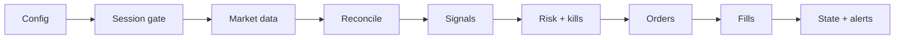

# Toss Trading Bot

## Overview

Automated US equity trading bot built on the **Korea Investment & Securities (KIS) OpenAPI**. It supports **dry-run**, **VTS sandbox**, and **guarded live** execution modes.

The focus is **execution safety**: broker/local reconciliation, fill verification before state changes, risk gates, Telegram monitoring, kill switches, and long-running EC2 operation—not maximizing backtest CAGR.

This is **experimental infrastructure**. Backtest and VTS results do **not** guarantee live profitability.

**Current VTS setup (frozen):** dual strategy Legacy 70% + Top4 momentum 30% on `$100,000` `CAPITAL_AT_RISK`, 25-ticker watchlist. See [docs/STRATEGY.md](docs/STRATEGY.md) for details.

---

## Why I built this

- Learn what a **real automated trading stack** looks like beyond notebook backtests: API auth, order lifecycle, persisted state, and failure modes.
- Handle **broker vs local state mismatch** (partial fills, VTS quirks, manual drift) with reconciliation instead of trusting memory alone.
- Test **risk gates**, fill polling, and operational tooling before trusting capital.
- Run **unattended on EC2** during military service with monitoring, pauses, and backups—not “set and forget alpha.”

---

## Key Features

- Multi-asset US equity watchlist (25 names, sector tags in `market_registry.py`)
- KIS OpenAPI integration (OAuth, orders, balances, fills)
- **Dry-run** / **VTS** / **guarded live** modes
- Broker/local **portfolio reconciliation** (`PortfolioReconciliationEngine`)
- **Fill verification** before mutating `trading_state.json` (`OrderFillMonitor`)
- Telegram trade, system, and EOD reports
- Kill switches: `TRADING_PAUSED`, `ALLOW_NEW_BUYS`, `EMERGENCY_LIQUIDATE` (+ confirm phrase)
- **Safety latch**: auto-block new BUYs after repeated anomalies (`safety_latch.json`)
- **Heartbeat** + stale-loop detection (`heartbeat.json`, `scripts/ec2_healthcheck.py`)
- Daily local backup script (`scripts/daily_backup.py`)
- GitHub Actions: `pytest` on push/PR

---

## Safety First

| Topic | Policy |
|--------|--------|
| **Live trading** | Requires `KIS_ENVIRONMENT=live`, `KIS_LIVE_CONFIRMED=true`, Telegram enabled, and positive exposure limits—startup fails otherwise. |
| **VTS / dry-run** | Default path for development and unattended runs. |
| **Emergency liquidation** | Needs `EMERGENCY_LIQUIDATE=true` **and** `EMERGENCY_LIQUIDATE_CONFIRM=I_UNDERSTAND_THIS_WILL_SELL`. Test in VTS first. |
| **Auto git pull on EC2** | Not recommended while unattended—process restart (`Restart=always`) is OK; code auto-update is not. |
| **Positioning** | Production-**inspired** safeguards on **experimental** strategy code—not a verified money machine. |

OOS validation **reduces, but does not eliminate, overfitting risk.**

---

## Architecture

High-level RTH pipeline:

1. Load config and credentials (`.env`, KIS token cache)
2. Check US market session (calendar + 09:30–16:00 ET)
3. Refresh OHLCV cache (`MarketDataCache`)
4. Reconcile broker vs local holdings and cash
5. Evaluate Legacy + Top4 signals per ticker / rebalance day
6. Apply risk gates, kill switches, and safety latch
7. Place or simulate orders (dry-run / VTS / live)
8. Poll fills; mutate state only on confirmed fills
9. Update `trade_log.csv`, heartbeat, logs, and Telegram

Orchestration: `watchlist_cycle.py` · Orders/state: `main.py` · Signals: `analytics.py`



---

## Running Modes

| Mode | Env / behavior | Orders |
|------|----------------|--------|
| **Dry-run** | `KIS_DRY_RUN=true` | Simulated instant fills locally; no broker API for orders |
| **VTS** | `KIS_ENVIRONMENT=vts` (default) | KIS mock sandbox (`openapivts.koreainvestment.com`) |
| **Live** | `KIS_ENVIRONMENT=live` + `KIS_LIVE_CONFIRMED=true` | Real account; strict guards; start with **small** `CAPITAL_AT_RISK` |

---

## Quick Start

```powershell
pip install -r requirements.txt
copy .env.example .env
# Edit .env: KIS keys, CANO, Telegram (optional)
```

**Tests:**

```powershell
pytest -q --ignore=scripts/
```

**Dry-run (no broker orders):**

```powershell
# .env: KIS_DRY_RUN=true
python main.py
```

**Healthcheck (EC2 or local):**

```powershell
python scripts/ec2_healthcheck.py --dry-run
python telegram_notifier.py --diagnose
```

**Deploy, monitor, EC2, Telegram:** see [docs/OPERATIONS.md](docs/OPERATIONS.md)  
**Long absence / pause / backup:** see [docs/MILITARY_RUNBOOK.md](docs/MILITARY_RUNBOOK.md)

---

## Tests

```powershell
pytest -q --ignore=scripts/
```

CI runs the same suite on push/PR (`.github/workflows/ci.yml`). No real KIS credentials required—tests use mocks and env overrides.

---

## Documentation

| Doc | Contents |
|-----|----------|
| [docs/OPERATIONS.md](docs/OPERATIONS.md) | Deploy, EC2/systemd, `.env`, Telegram, troubleshooting |
| [docs/MILITARY_RUNBOOK.md](docs/MILITARY_RUNBOOK.md) | Pause trading, emergency flatten, backups, checklist |
| [docs/STRATEGY.md](docs/STRATEGY.md) | Dual Legacy/Top4, watchlist, gates, backtest commands |
| [docs/RISK.md](docs/RISK.md) | Residual risks, parity gaps, monitoring matrix |
| [docs/RESEARCH_LOG.md](docs/RESEARCH_LOG.md) | Phase history, ablations, improvement journey |
| [docs/CHANGELOG.md](docs/CHANGELOG.md) | Release notes and phase timeline |
| [docs/REFERENCE.md](docs/REFERENCE.md) | Full legacy README (deep technical reference) |

---

## Project layout (short)

```
main.py                 # KIS client, order dispatch, main loop
watchlist_cycle.py      # RTH orchestration
analytics.py            # Signals, sizing, regime
execution_engine.py     # RiskGuard, fills, trade log
session_manager.py      # Reconciliation
operational_safety.py   # Kill switches
safety_latch.py         # Auto BUY block after anomalies
heartbeat.py            # Stale-failure timestamps
scripts/                # Backups, healthcheck, research sweeps
test_*.py               # Pytest suite
```

---

## Disclaimer

- **Educational and experimental** project for learning automated trading infrastructure.
- Backtest and VTS results **do not** guarantee live performance.
- Automated trading **can lose money**; bugs, API outages, and regime change are real.
- **Live trading** only with small capital, explicit confirmation flags, and manual review.
- Not financial advice.

**Freeze tag (pre–military service):** `military-freeze-v1`
