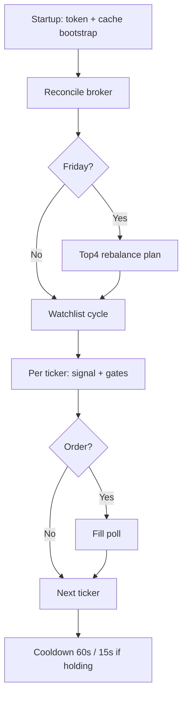

# Strategy

Concise strategy and architecture reference. Full math and chronology: [REFERENCE.md](REFERENCE.md).

---

## Dual deployment (Phase 4)

| Leg | Capital | Behavior |
|-----|---------|----------|
| **Legacy** | 70% of `CAPITAL_AT_RISK` | Swing signals on full watchlist (breakout / crossover / filters per ticker regime) |
| **Top4** | 30% | Momentum rank; **Friday** rebalance; Top 4 names, hold band = 1 |

Shared broker account; `strategy_ownership.py` prevents both legs from opening the same ticker.

**Env:** `DEPLOYMENT_PHASE=4`, `STRATEGY_MODE=dual`, `LEGACY_CAPITAL_PCT=70`, `TOP3_CAPITAL_PCT=30`

---

## Watchlist

- **25 US equities** — 15 tech core + 10 non-tech (healthcare, finance, energy, consumer, industrial)
- Configure via `WATCHLIST` in `.env`
- Routing: `market_registry.py` (`MARKET_META`, `TICKER_SECTORS`)

---

## Legacy signal engine (`analytics.py`)

**Entry modes** (per ticker config): breakout, crossover, dual.

**Exits (priority):** hard stop → profit trail → trend below 50MA → ATR trail → death cross → RSI crossdown.

**Sizing:** dual-clamp — min(risk budget, 95% of deployable / price). See [REFERENCE.md](REFERENCE.md) §4.

**Regime:** SPY 200MA gate; optional QQQ half-size when SPY bear / QQQ bull.

---

## Top4 momentum (`top3_strategy.py`, `momentum_ranker.py`)

- Rank watchlist by momentum score weekly
- Rebalance on **Friday** (`MOMENTUM_REBALANCE_WEEKDAY=4`)
- Equal-weight targets within Top4 pool; trim/add vs broker holdings

---

## Live RTH pipeline



### BUY gate order (Legacy)

1. US RTH + calendar open  
2. SPY / QQQ regime  
3. Momentum Top-N (if enabled on single-strategy mode)  
4. Strategy ownership (dual)  
5. RTH open/close windows  
6. `RiskGuard` (daily loss, max positions, sector, ticker/portfolio caps)  
7. Kill switches + safety latch  

---

## Backtest commands

```powershell
# Portfolio backtest (default friction: 0.1% + 5 bps)
python run_backtest.py

# Isolated single-ticker
python run_backtest.py --isolated

# Walk-forward
python run_backtest.py --walk-forward

# Dual Legacy + Top3 compare
python run_backtest.py --strategy dual
```

**Parity note:** Backtest default fill = next session open; live uses RTH limit orders. Live intraday ATR uses `session_low` unless `USE_EOD_ATR_STOPS=true`. See [RISK.md](RISK.md).

---

## Key modules

| Module | Role |
|--------|------|
| `config.py` | Per-ticker `StrategyConfig` |
| `analytics.py` | `LiveSignalEngine`, indicators, sizing |
| `portfolio_backtest.py` | Multi-ticker backtest |
| `top3_backtest.py` | Top-N backtest |
| `deployment_config.py` | Phase 1–4 deployment flags |
